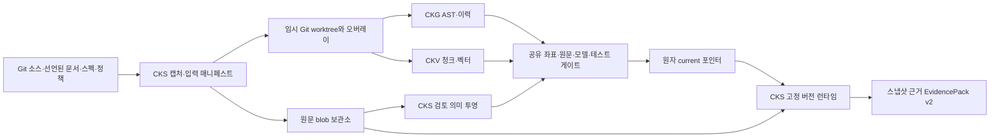

# Knowledge System 종단 간 상세 설계 v1

작성일: 2026-09-30 · 기준 구현: `feat/spec-driven-knowledge-system` @ `c0654ed` · 대상: 로컬 Ollama, `knowledge-system` 파일럿, macOS arm64/Linux arm64·amd64. Linux CPU가 특정되지 않았으므로 양쪽을 지원 대상으로 설계했다.

## 0. 설계 상태와 읽는 법

이 문서는 **A(모델 독립 개발)부터 B(실모델 평가), C(평가 후 수정·출시)까지 먼저 설계**한다. 구현 중 결정할 데이터 소유권, ID, 공개 응답, 마이그레이션, 원자성, 실패 상태를 아래에서 고정한다. 실제 성능 수치와 도메인 개념의 옳고 그름은 실험/검토 결과이지 설계 선택이 아니므로 별도 수용 게이트로 둔다. 원 WBS의 요구 ID는 [`DELIVERY-PLAN-V2.md`](./DELIVERY-PLAN-V2.md)의 R2-01–08과 v0.1 FR/INV/NFR를 따른다. PDF 원문을 포함한 도메인 근거는 `study/docs/reviews/knowledge-system/ckv-ckg-ontology-installation-proposal.md`에 있다. PDF의 사례를 이 프로젝트의 현행 구현으로 오인하지 않는다.

**설계 결론:** CKS가 프로젝트/스냅샷/데이터셋의 **소유자**다. CKG는 AST·이력 그래프, CKV는 청크·벡터/BM25, CKS 의미 투영은 검토된 개념·요구·근거의 파생물이다. 하나의 후보 디렉터리에 세 결과와 원문 보관본을 만든 뒤 **하나의 `current` 포인터**로 승격한다. 어떤 엔진도 v2 활성 데이터를 제자리 변경하지 않는다.



## 1. 코드에서 확인한 충돌 지점

| 현재 코드 | 문제 | 설계 조치 |
|---|---|---|
| `internal/setup/verify.go`, `internal/system/mcp/alignment.go`, `internal/system/semantic/alignment.go` | 커밋·그래프 다이제스트와 절대 `src_root`를 비교하며 구 좌표 누락은 일부 경고다. | 동일한 `DatasetCoordinates` 검증기를 setup/semantic/runtime에서 재사용. v2 필수 ID 누락·불일치는 모두 오류. 절대 경로는 표시용. |
| `internal/vector/manifest/manifest.go`, `internal/graph/persist/manifest.go` | 엔진마다 별도 매니페스트이고 프로젝트/스냅샷/데이터셋 ID가 없다. | 공통 좌표 헤더를 JSON sidecar와 두 DB의 manifest에 모두 기록하고 교차 검증. |
| `internal/system/semantic/model.go`, `internal/system/semantic/store.go` | 의미 DB가 별도 활성 포인터를 가지며 커밋 Git 객체로 원문을 검증한다. | v2 의미 DB는 후보 버전 안에 포함. `source_mode`별 원문 해석기를 사용하며 전체 활성 포인터는 CKS 하나. |
| `internal/system/composer/budget/filesystem.go` | 현재 작업 파일을 읽고 절대 인용 경로는 루트를 무시한다. 심볼릭 링크 탈출도 막지 못한다. | 런타임 본문은 검증된 원문 blob만 읽는다. 절대·`..`·링크·미등록 경로는 오류/근거 누락으로 처리. |
| `pkg/system/contract/citation.go` | 인용 중복 키는 파일/줄만 사용하며 커밋도 무시한다. | v2 키는 프로젝트·스냅샷·원천 ID·경로·줄·원문 해시. 작업 트리에는 `commit_hash`를 비워 구 클라이언트의 HEAD 오해를 막는다. |
| `pkg/system/contract/pack.go` | 기본 무결성 해시에서 선택형 의미 필드가 빠진다. | v2 팩 해시는 좌표·인용·본문·의미 필드를 모두 포함. 기존 해시는 v1 응답에만 유지. |
| `pkg/vector/types/embed.go`, `pkg/vector/embed/ollama/adapter.go` | provider/태그/차원만 같으면 같은 Ollama 모델로 판단할 수 있다. | 모델 다이제스트와 전처리/쿼리 정책을 정체성에 고정. |
| `internal/setup/reindex.go`, `internal/system/mcp/ops_index.go` | 여러 빌드 진입점과 별도 의미 활성화가 있다. | 모든 v2 쓰기는 CKS 후보 빌더로 통일. MCP 유지보수 도구도 이를 호출하며 기존 제자리 갱신은 legacy에만 허용. |

## 2. 공유 좌표와 입력 매니페스트

### 2.1 ID와 직렬화

`project_id`는 `cks init --project-id`에 명시하거나 UUIDv4로 한 번 생성해 설정과 데이터셋 루트의 `project.json`에 저장한다. 프로젝트 표시 이름·Git remote·경로를 ID로 재계산하지 않는다. pilot은 명시적으로 `knowledge-system`을 사용한다. 중복 ID가 다른 루트의 기존 `project.json` 또는 다른 소스 지문과 만나면 자동 병합하지 않고 `project_conflict`다. 사용자가 프로젝트를 이동할 때는 함께 옮긴 `project.json`이 신원의 근거다.

각 입력의 `origin_id`는 `repo`, `docs:<선언한 이름>`, `ontology`, `spec`, `policy:<이름>`, `flow:<이름>` 중 하나다. v2는 네트워크 문서 수집을 지원하지 않는다. 외부 문서는 설정에 이름과 로컬 루트를 명시해야 하며 캡처 후 인용에는 로컬 절대 경로 대신 `origin_id`와 상대 경로를 쓴다. 생성 의미 텍스트는 원본 ontology/spec 파일 해시와 렌더러 버전을 빌드 레시피에 넣고 출력 바이트를 **파생 매니페스트**로 별도 검증한다. 생성 출력의 해시는 빌드 전 `dataset_id`에 넣지 않아 순환 신원을 만들지 않는다.

파일 레코드는 `{origin_id, path, kind, size, sha256}`다. `path`는 `/` 구분의 저장소/원천 상대 경로로, `.`·`..`·절대 경로·NUL·비UTF-8·NFC 정규화 후 중복·macOS 대소문자 충돌을 거부한다. 일반 파일만 보관한다. 심볼릭 링크는 내부 링크도 자동 추적하지 않고 `doctor`의 미지원 개수로 표시한다. 각 경로 성분은 루트 디렉터리 핸들에서 `openat` 계열의 no-follow 방식으로 열어 검사한다. 단순 문자열 검사 뒤 `os.ReadFile`하는 시간차 취약성을 피한다. 비밀/제외 경로는 양 엔진이 공통으로 해석하는 정책으로 캡처 전에 제거하고, 사유·개수만 기록한다. CKG의 실제 파일 목록은 원본 입력 매니페스트의 허용 부분집합이어야 한다. CKV는 그 목록과 검증된 **파생 매니페스트**의 합집합만 읽는다. 선언된 원본 입력의 누락이나 미등록 파생 파일은 게이트 실패다.

`file_manifest_digest`는 레코드를 `(origin_id,path)` 순으로 정렬하고 각 문자열을 UTF-8 길이 접두어로 직렬화해 SHA-256 한다. 레코드 구분과 필드 구분의 모호성을 없애며 정규화 구현의 골든 바이트를 저장한다. `source_mode`는 `committed|working-tree|snapshot-only`다. 마지막 모드는 Git이 없는 프로젝트의 정적 파일 스냅샷이며 `base_commit`은 빈 값으로 직렬화한다. `snapshot_id = SHA256("cks.snapshot.v2\0" || project_id || source_mode || base_commit || file_manifest_digest || capture_policy_digest)`다. `dataset_id = SHA256("cks.dataset.v2\0" || snapshot_id || build_recipe_digest)`다. 모든 결합 항목은 같은 길이 접두어 규칙을 쓴다. `build_recipe_digest`에는 CKG/CKV/CKS 스키마·파서/청커 버전, 선택 파일/정책, 온톨로지·스펙 입력, 임베딩 정체성, 의미 렌더러 버전, 대상 OS/CPU와 빌드 태그/Go 버전이 들어간다. OS별 파서/빌드 태그로 결과가 달라져도 같은 데이터셋 ID가 되지 않게 한다. **출력** 그래프·벡터·의미 다이제스트는 순환 ID를 만들지 않도록 계산에서 제외하고 완료 뒤 별도 검증한다.

DB와 sidecar가 공유하는 `CoordinateHeader`의 필수 필드는 `format_version=2`, `project_id`, `dataset_id`, `snapshot_id`, `source_mode`, `base_commit`, `file_manifest_digest`, `build_recipe_digest`, `embedding_identity`(graph-only면 `none`), `capabilities`, `input_count`다. 빌드가 끝난 뒤 최상위 **`CompletionManifest`**가 이 헤더에 `graph_digest`, `vector_db_sha256`, `semantic_digest`(의미 없음이면 명시적 `none`), `derived_manifest_digest`를 더한다. 출력 DB의 물리 SHA를 그 DB 안에 쓰는 자기 참조는 금지한다. `src_root`는 운영 표시용이며 조인 키가 아니다. `--version`은 사람이 읽는 디렉터리 별칭이고 ID가 아니다. 프로젝트·원천·데이터셋 ID가 하나라도 다른 교차 계층 조회는 거부한다.

### 2.2 캡처와 보관

`committed`는 깨끗한 HEAD만 받되, 선언한 저장소 **밖** 문서는 그 시점의 바이트를 별도 origin으로 캡처한다. 저장소 원문은 HEAD Git 객체에서 캡처해 후보의 `sources/blobs/<sha256>`에 보관한다. `working-tree`는 현재 추적 수정/삭제와 신규 일반 파일을 포함해 같은 저장소 외부의 임시 Git worktree를 HEAD에 만들고 허용된 바이트를 오버레이한다. 삭제 파일은 staged worktree에서도 삭제한다. `snapshot-only`는 Git이 없는 디렉터리를 같은 no-follow 방식으로 복사한 **일반 staging 트리**에서 AST/청크를 만들며 temporal/blame/커밋 기반 기능을 `history_unavailable`로 표시한다. 선택 파일 목록과 생성된 filelist는 원본에서 한 번 계산해 고정하고 staging에 적용한 뒤 양 엔진의 실제 입력 목록과 대조한다. 캡처는 안전하게 연 파일 핸들의 메타데이터·바이트와 원본을 재확인해 중간 변경을 실패시킨다. 빌더는 **오직 staging**을 읽는다. 캡처 완료 후 원본이 달라져도 이미 캡처한 후보는 일관된 과거 스냅샷이다. 무거운 복사에 하드링크를 쓰지 않는다. 보관본은 콘텐츠 주소와 읽을 때 SHA-256으로 검증한다.

CKG의 temporal/blame은 작업 트리의 수정 줄을 커밋된 이력으로 주장해서는 안 된다. 변경 파일의 Git 이력은 `base_commit`까지의 과거로만 표시하고 새 줄의 blame/`changed_in`은 생성하지 않는다. `snapshot-only`에서는 이력 패스를 실행하지 않는다. 구조 AST는 staging 바이트에서 생성한다. 작은 Go 픽스처에서는 임시 worktree가 수정된 AST와 HEAD 이력을 동시에 빌드했지만, 현재 CKG 매니페스트에 임시 절대 경로가 남았다. 따라서 빌더에 **`build_root`와 `logical_root`/좌표를 분리**해 전달하며 공개 매니페스트·DB·인용에는 임시 경로를 저장하지 않는다.

원문 보관본은 활성 또는 롤백 가능한 버전이 참조하는 동안 삭제할 수 없다. 정리는 참조 수를 검사하는 별도 `cks gc --dry-run`/`cks gc` 명령으로만 한다. 런타임은 원본 저장소가 이동/삭제돼도 보관본으로 인용을 재현한다. Git 이력 탐색처럼 원본 객체 저장소가 필요한 기능은 없으면 `history_unavailable`로 낮추되 AST/벡터/인용의 신뢰성을 낮추지 않는다.

캡처의 기본 운영 상한은 파일 100,000개, 단일 파일 32 MiB, 총 원문 4 GiB, 후보 빌드 2시간이다. 설정에서 각 한도를 올릴 수 있지만 초과를 조용히 건너뛰지 않고 `resource_limit`와 예상/실제 수를 보고한다. 대형 프로젝트 프로필의 한도 증가는 `doctor`의 용량 예상과 데이터셋 루트의 여유 공간 확인 뒤 수행한다. `snapshot-only`도 같은 상한과 원문 검증을 적용한다.

## 3. 빌드·승격·실행 트랜잭션

`<dataset-root>/<version>/{sources,graph,vector,semantic,manifest.json}`를 하나의 불변 후보로 만든다. `semantic/semantic.db`는 해당 후보 안에서만 활성 투영을 가리킨다. graph-only 후보는 `vector=none`, `embedding=none`을 명시하며 CKV/CKS 의미 검색을 서비스 가능한 것처럼 보고하지 않는다. CKG/CKV 독립 CLI는 진단 인덱스를 만들 수 있으나 v2 활성 후보를 직접 승격할 수 없다.

상태는 `capturing → building → verifying → ready → active` 또는 `failed`다. 하나의 데이터셋 루트에는 OS 파일 잠금(`flock`)으로 빌드/승격/롤백을 직렬화한다. 현재의 나이 기반 잠금 탈취는 v2 경로에서 사용하지 않는다. 실패 후보는 원인과 로그 해시를 남기며 활성 포인터를 바꾸지 않는다. 빌드/검증 후 모든 DB를 checkpoint·close하고 파일/디렉터리를 fsync한 뒤 상대 `current` 링크를 원자 rename하고 부모 디렉터리를 fsync한다. 중간에 프로세스가 죽으면 이전 `current` 또는 완성된 새 후보만 보인다. 다음 실행은 상태를 검사해 미완성 후보를 별도 정리한다.

승격 전 게이트는 입력 blob과 원본/파생 파일 목록, CKG 현재 파일 감사/파서 오류, CKV 청크·줄·canonical ID, 그래프 다이제스트 핀, 의미 관계/CKV 조인, Ollama 다이제스트, 선택 테스트 명령, 공개 팩 골든을 같은 `dataset_id`로 검사한다. 최상위 `CompletionManifest`가 DB/sidecar의 좌표와 출력 파일 해시를 봉인한 뒤에만 `ready`가 된다. `cks.ops.index`, `cks setup`, 새 `cks index`는 **같은 후보 빌더**를 호출한다. runtime `current`는 시작 시 한 번 해석하고 핸들을 고정한다. 승격·롤백 뒤 새 프로세스가 새 버전을 열며 기존 프로세스는 이전 버전을 계속 제공한다. 건강 상태에 두 ID를 보여 재시작 필요를 알린다.

구버전 v1 인덱스는 커밋형 **읽기 전용**으로 서비스할 수 있지만 `legacy_unpinned`을 건강 상태에 표시하고 새 의미 승격·작업 트리 질의·v2 근거 조인에 참여하지 못한다. 기존 파일을 제자리 변환하지 않고 v2 전체 재색인한다. 기존 `setup`/MCP 응답은 커밋형 v1 호환 경로에 남긴다. v2 후보를 옛 서버가 열면 이해하지 못하는 major 버전으로 명시 실패한다.

## 4. Ollama 임베딩과 CKV 검색

### 4.1 임베딩 공간의 정확한 신원

`EmbeddingIdentityV2 = {provider, canonical_model_name, model_digest, native_dim, output_dim, dimension_method, pooling, normalization, passage_transform_version, query_transform_version, truncate_policy, identity_version}`다. 로컬 Ollama는 시작 때 [모델 목록 API](https://docs.ollama.com/api/tags)에서 **정확히 하나의** 선택 이름과 다이제스트를 찾고 [임베딩 API](https://docs.ollama.com/api/embed)로 출력 차원을 확인한다. `:latest` 별칭은 명시적 이름으로 정규화하되 같은 별칭의 모호한 응답은 실패한다. 다이제스트 형식 오류·누락은 실모델 색인/질의를 거부한다. 현재 클라이언트가 차원을 잘라 재정규화한다면 그 방법과 버전을 기록한다. query prefix 환경 변수는 운영 중 조용히 바뀌는 전역 상태가 아니라 설정·매니페스트의 명시적 값으로 승격한다.

Ollama 임베딩 요청은 `truncate:false`를 명시해 예상치 못한 서버 측 자르기를 오류로 만든다. 청커가 허용 입력 길이를 먼저 제한하고 초과 오류는 원문/모델 정보를 가진 실패로 보고한다. API 응답의 모델명·벡터 개수·차원·NaN/Inf를 검증한다. 색인 시작/종료와 질의 열기 및 **각 배치 전/후**에 다이제스트를 다시 조회하고 달라지면 후보 전체를 실패시킨다. 모델 목록과 임베딩 응답 사이의 원자적 버전 고정 기능은 현재 API 계약에 없으므로, 로컬 Ollama 데몬과 모델 관리자를 **신뢰된 단일 운영 주체**로 가정하고 빌드 중 모델 태그 변경을 금지한다. 외부 행위자가 태그를 바꿨다가 되돌리는 ABA 공격까지 증명할 수 있다고 주장하지 않는다. 모형 서버의 일반 태그 교체 실패 주입과 운영 절차를 함께 검증한다.

구 checksum과 v2 identity는 다른 필드로 병행 기록한다. v1 Ollama 색인은 다이제스트가 없으므로 v2 실모델 질의에서 `reindex_required`다. 다른 제공자는 필요한 신원 값을 제공하지 못하면 v2 의미 검색을 지원하지 않는다고 명시한다. mock은 고정 알고리즘 버전으로 구조 시험에만 사용한다. Ollama가 중단되면 CKG/BM25 조회는 선택한 서비스 능력 범위 안에서 남기되 벡터/온톨로지 결합 결과를 성공으로 위장하지 않는다.

### 4.2 CKV 후보와 상태

필터의 의미는 `project_id ∧ snapshot_id ∧ 접근 범위 ∧ (언어/경로/종류/커밋/제외)`다. 내부 저장소 질의가 빠뜨린 조건도 최종 `Matches` 판정을 거친다. 허용 후보 수가 작은 경우 필터된 정확 거리 계산을 선택하고, 큰 경우 ANN 후보를 늘린 뒤 K개 미만이면 정확 경로로 보충한다. 시간/메모리/취소 예산으로 끝내지 못하면 `SearchResult{hits, eligible_count, searched_count, status=incomplete|cancelled, reason}`을 돌려준다. 정상 `complete`는 허용 후보 ≥K일 때 K개이며 허용 후보 <K일 때 그 수만 반환한다. 근사 top-K 정확도는 개수와 별도 지표다. 구 CLI/MCP가 상태를 표현하지 못하면 부분 결과를 정상 응답으로 주지 않고 명시 오류를 반환한다.

Markdown은 안정 부모/자식 ID, 제목 경로, 원문 줄·해시를 보존한다. v2 청크 ID에는 `origin_id`, 상대 경로, 범위, 내용 해시와 청커 버전을 포함해 서로 다른 문서 루트의 동명 파일이 충돌하지 않게 한다. 임베딩 텍스트의 제목/인접 문맥과 **인용 원문 범위**를 구분한다. 본문 확장은 선택된 child의 원문 보관본만 읽고 예산 내 이웃 줄을 별도 인용으로 붙인다. 구 DB 청크 마이그레이션은 재색인하며 ID 규칙 버전을 레시피에 넣는다. 같은 경로의 다른 `origin_id`는 같은 문서가 아니다.

## 5. CKG와 CKS의 근거 조합

CKG 현재 파일 감사는 현재 `File` 노드를, 역사 검색은 별도 temporal 그래프를 사용한다. CKG가 보유한 `canonical_id`는 오직 동일 `project_id/snapshot_id`의 CKV 코드 청크에 연결된다. AST 파서 실패/미지원 언어는 `degraded`로 표시하고 문서 텍스트 근거로 AST 관계를 만들어내지 않는다. `graph_digest`는 논리적 코드 그래프 핀으로 유지하고 `enrich_digest`·parse coverage를 별도 기록한다. 그래프 다이제스트가 이력을 제외하더라도 `snapshot_id`가 다른 데이터셋을 동일 버전으로 합치지 않는다. 정책/보안 오버레이가 바뀌면 레시피가 달라 새 데이터셋이다. 모든 검색/임베딩/개념 캐시 키에는 최소 `project_id`와 `dataset_id`를 포함해 같은 이름의 두 저장소가 캐시를 공유하지 않는다.

CKS 질의는 한 고정 `dataset_id`를 열고 **raw query**를 CKV/CKG/BM25에 전달한다. 어휘/온톨로지는 원문을 대체하지 않는다. 개념 후보는 다국어 별칭과 모호성 점수를 가진 복수 목록이며 `verified` 관계만 기본 상위 K 후보의 순서를 제한적으로 바꾼다. 원래 상위 K의 ID 집합은 유지한다. 저장소가 없거나 검증 실패/시간 초과/예산 초과면 기본 경로로 돌아가고 `ontology_state=unavailable|stale|budget_exceeded`를 남긴다. ontology flag의 기본값은 B/C 판정 전까지 `off`다. 원문 검색 후보가 0이면 개념 텍스트 별도 검색은 수행할 수 있으나 이를 원래 후보였다고 표시하지 않고 출처/경로를 분리한다.

기본 구조 상한은 현재 Stage 2의 개념 후보 8개·점수 증가 최대 20%, Stage 3의 확장 seed 10개/이웃 50개, EvidencePack 본문 8,000 토큰/인용 12개를 유지한다. 이 값은 안전한 작업 범위이지 품질 합격 수치가 아니다. 설정에서 조정하되 실제 사용값을 팩과 B 평가에 기록하고, 상한으로 생략된 근거를 `budget_exceeded`/`incomplete`로 드러낸다.

`EvidenceRef`는 `{project_id,dataset_id,snapshot_id,origin_id,path,start_line,end_line,file_sha256,content_sha256,canonical_id?,chunk_id?,status}`다. `file_sha256`은 보관된 전체 파일, `content_sha256`은 인용 줄 범위의 **정화 전 원문 바이트**를 뜻한다. 원문 조회는 보관본의 매핑 테이블에서만 수행하고 두 해시/줄을 다시 검사한다. 절대 경로, `..`, 미등록 source, 손상 blob은 인용을 조용히 건너뛰지 않고 `source_missing` 또는 `snapshot_mismatch`로 표시한다. sanitization은 검증된 본문에 적용한 뒤에만 팩을 외부로 내보낸다. 팩 해시는 정화된 출력 본문을 보호하고 원문 해시를 본문 대신 공개하지 않는다. 보관본 읽기 오류로 중요한 근거가 빠지면 팩의 `evidence_state=partial`이고 확정 답변 상태가 될 수 없다.

## 6. 온톨로지·스펙·외부 패치의 의미 계약

원본은 프로젝트에 커밋된 YAML/Markdown이며 CKS 의미 SQLite는 해당 데이터셋의 **파생 투영**이다. 최소 객체는 `Concept`, `Term`, `DocumentSection`, `Claim`, `Requirement`, `AcceptanceCriterion`, `Assertion`, `EvidenceSpan`, `PolicyRef`, `PatchAttempt`, `TestExecution`, `CriterionDecision`이다. 각 객체/관계는 타입·방향·원천·프로젝트/스냅샷·검토 상태를 가진다. `proposed`는 탐색 후보, `verified`는 원문과 검토자가 확인한 관계, `rejected`는 삭제되지 않는 판정 기록이다. 하나의 verified 관계가 오래된 소스/코드 심볼에 닿으면 새 데이터셋에서는 `stale`로 계산하고 자동 이전하지 않는다.

`Concept IMPLEMENTED_BY CodeSymbol`, `CodeSymbol TESTED_BY TestCase`, `AcceptanceCriterion ACCEPTED_BY TestCase`는 **연결의 존재**를 나타낸다. `TestExecution.pass`는 지정 테스트가 해당 스냅샷에서 실행돼 성공했다는 뜻이다. `CriterionDecision.approved`는 사람이 Given/When/Then의 의미 충족을 확인했다는 별도 사건이다. 이 네 상태를 합산해 자동으로 요구사항 완료라 하지 않는다. 요구사항 상태는 `missing|proposed|linked|tested|accepted|conflict|stale`로 계산하며 각 전이에 원천 ID와 이유를 남긴다.

외부 패치는 `patch_id`, `base_snapshot_id`, 변경 파일·해시, 결과 스냅샷/커밋, 실행 보고서, 검토자·판정, 새 `dataset_id`를 불변 기록으로 가진다. 같은 ID의 다른 바이트는 오류다. 실패 테스트, 소스 변경, 거부/미검토 기준 또는 충돌 관계가 있으면 후보를 활성화하지 않는다. 이전에 승인한 개념/스펙은 새로운 소스에 대해 재검증되며 별도 새 데이터셋의 근거가 필요하다. CKS는 변경 계획과 증거를 제공하되 코드를 자율 수정하지 않는다.

## 7. 공개 CLI/MCP 계약과 호환성

| 표면 | v2 계약 | 기존 호출의 처리 |
|---|---|---|
| `cks init` | 안정 `project_id`, 데이터셋 외부 경로, 입력 root 이름, Ollama 설정, 제외 정책 저장; 기존 설정 덮어쓰기 금지 | 기존 플래그 유지, 새 필드는 선택 가능하나 v2 빌드 전 필수 값 생성 |
| `cks index`/`setup` | 동일 후보 빌더. `--source-mode committed|working-tree|snapshot-only`, `--version`, 게이트/실패 리포트 | `setup`은 기존 옵션 호환, v2 좌표 생성은 동일 코어 사용 |
| `cks status`/`doctor` | 활성/서빙 ID, 각 기능 `ready|degraded|unavailable`, 원인·입력 수·모델 신원·재시작 필요 | 기존 진단 JSON 필드 보존 |
| `cks serve`/`mcp` | 시작 때 후보 전체 좌표 확인 후 한 버전 고정; 표준입출력과 loopback HTTP | 구 `mcp` 유지, 부적합 v2 자료는 오류 |
| `cks rollback`/`setup --rollback` | 완성된 대상 버전만 원자 전환; 다음 서버부터 반영 | 기존 옵션 유지, v1↔v2 이동도 대상 검증 후만 허용 |
| 기존 `cks.context.get_for_task` | committed v1/v2의 기존 인용 형식만 제공; 작업 트리/비Git 스냅샷에서 `requires_v2` | HEAD로 오해할 수 있는 인용을 보내지 않음 |
| 새 `cks.context.get_for_task_v2` | 좌표·원천 ID·원문 해시·검색/온톨로지 상태·통합 팩 해시 필수 | 클라이언트가 명시 선택 |
| `ckv query`·`ckg` 검색/HTTP API·정적 export | 작업 트리/비Git 스냅샷 결과에는 동일한 v2 인용 좌표를 제공하고 형식을 지정하지 않은 구 출력은 `requires_v2` | 커밋형 구 출력은 유지. 그래프 viewer/export에도 `source_mode`를 표시 |

v2 `Citation`은 기존 `file/start_line/end_line/commit_hash`에 프로젝트/데이터셋/스냅샷/원천/원문 해시를 더한다. `committed`는 `commit_hash=base_commit`, `working-tree`와 `snapshot-only`는 `commit_hash=""`를 사용한다. 작업 트리의 `base_commit`은 이력 기준이며 비Git은 빈 값이다. dedup key는 새 좌표 전체를 포함한다. v2 팩의 `integrity_hash_algo=sha256-v2`는 좌표·본문·semantic overlay까지 포함한다. 구 소비자가 모르는 알고리즘을 조용히 받아들이지 않게 기존 검증기는 실패한다. v1 팩과 v1 해시는 변경하지 않는다. HTTP 응답도 같은 v2 envelope를 사용한다.

오류 코드는 `project_conflict`, `snapshot_mismatch`, `source_missing`, `reindex_required`, `embedder_unavailable`, `model_changed`, `parse_degraded`, `incomplete`, `resource_limit`, `requires_v2`, `unreviewed`, `criterion_conflict`, `candidate_failed`로 고정한다. CLI는 비정상 종료와 기계 판독형 `code/message/dataset_id?`를 함께 반환한다. MCP는 도구 오류의 같은 `code`를 사용한다. 원문 비밀·절대 staging 경로·HTTP 응답 본문은 오류에 넣지 않는다.

## 8. 설치·업그레이드·운영

패키지는 대상별 `cks`, `ckg`, `ckv`, 기본 정책, 라이선스, `manifest.json`, SHA-256, Go 모듈 목록을 담는다. 대상은 **macOS arm64, Linux arm64, Linux amd64**다. CGO/sqlite-vec이 있으므로 대상 OS/CPU의 네이티브 빌드와 압축 해제한 산출물의 런타임 스모크를 각각 수행한다. Linux 빌드 이미지에는 SQLite 개발 헤더를 포함하지만 런타임 의존성과 라이선스는 별도로 감사한다. 수동 설치 v1에는 자동 업데이트가 없다. 공개 릴리스의 `release.json`은 **아카이브 밖의 sidecar**로 아카이브 해시·OS/CPU·커밋·모듈/라이선스 목록을 담고, 그 정규 JSON 바이트를 별도 Ed25519 비밀키로 서명한 `release.json.sig`도 sidecar로 배포한다. 이로써 아카이브가 자신의 해시를 포함하는 순환을 피한다. 검증 공개키는 릴리스 문서에 고정한다. 최초 설치 전에는 신뢰된 별도 검증 스크립트, 설치 뒤에는 `cks package verify`가 서명과 아카이브/내부 해시를 검사한다. 미검증 아카이브의 바이너리를 최초 검증 도구로 실행하지 않는다. 비밀키는 저장소와 빌드 로그에 두지 않는다. 서명/라이선스/대상 스모크 전 아카이브는 `preview`다. Apple 전용 배포 채널의 코드 서명·공증은 이 CLI 아카이브의 첫 배포 범위 밖이라고 명시한다. Windows 및 다른 CPU도 v1 범위 밖이고 `unsupported`를 표시한다.

설치 흐름은 `doctor → init → index → status → serve → 질의 → 새 버전 index → restart → rollback → restart`다. Git Go, Git TypeScript, 비Git·미지원 코드+Markdown의 세 프로젝트를 독립 ID/데이터셋으로 수행한다. Python 등 미지원 AST는 문서 검색과 citation 가능 여부만 보고하고 허위 코드 그래프를 만들지 않는다. 비Git에서도 지원 언어의 AST는 생성하되 Git 이력만 낮춘다. `doctor`는 모델 서버가 없을 때도 파일 능력·권한·경로 정책을 보고할 수 있어야 한다. Ollama는 별도 로컬 서비스로 주입하며 설정 URL은 loopback이 기본이다. 서비스 중단은 CKG/BM25와 벡터 기능 상태를 각각 표시한다. HTTP MCP의 원격 노출은 기존 명시적 opt-in 경계를 유지한다.

업그레이드는 새로운 바이너리와 v2 후보를 옆에 설치하고 구버전 `current`를 유지한 채 스모크 후 전환한다. 롤백은 바이너리/데이터 형식 조합의 지원 범위도 검사한다. 구 바이너리는 이해하지 못하는 v2 데이터셋을 열지 못하므로 **데이터만** 이전 v1로 되돌리는 것으로 충분하지 않을 수 있다. 릴리스 아카이브에는 직전 호환 바이너리와 데이터셋 복구 절차를 기록한다. 실패 후보와 source blob의 용량·보관 기간을 `status`에 표시하고 `gc --dry-run`으로 안전한 회수 대상만 보여준다.

## 9. 평가와 결과 기반 재리팩토링까지의 설계

### 9.1 A: 모델 독립 증명

A 단계는 정확한 원문/ID/상태/호환성에 대한 **결정적 오라클**을 사용한다. 가짜 Ollama 서버는 이름/다이제스트/차원/응답 변경과 지연·오류를 재현하고 mock은 CKV→CKS 구조·인용·원자 승격에만 쓴다. `knowledge-system`의 고정 커밋에서 CKG 현재 파일 감사, canonical ID 정렬, CKV 청크 원문, 세 계층 활성 좌표를 기록한다. 자연어 Recall/품질 결론은 쓰지 않는다. 각 기능 PR은 최소 하나의 정상과 하나의 실패 시험, 이전 공개 계약 골든, 영향 범위에 맞는 통합 시험을 먼저 지정한다.

### 9.2 B: 실제 Ollama의 비교 실험

B0에서 모델명/다이제스트/차원/전처리/서버 버전, `knowledge-system` 커밋과 입력 매니페스트, 하드웨어·OS, 질문·정답 파일, 검사자를 **결과를 보기 전에** 고정한다. 질문군은 코드 심볼, 희소 필터, 긴 문서 끝, 한국어·영어·다의어, 미등록 표현, 답 없음, 스펙/코드 충돌, 오래된 인용, 두 프로젝트를 포함한다. 한 질문의 정답에는 파일·원문 줄·필요한 관계·기권 여부·기대 스냅샷을 기록한다. 개발/조정 질문과 최종 판정 질문을 분리해 후자를 튜닝에 사용하지 않는다.

동일 모델·코퍼스·질문·K·필터·하드웨어로 `CKV+CKG 기본`, `개념 텍스트만`, `관계만`, `둘 다`를 측정한다. Recall@K, MRR, 근거 precision, 답 없음의 거짓 인용률, 개념 오확정률, 스냅샷 충돌, warm p50/p95와 cold 시작, 색인 시간·크기, 모델 호출/CKS 합성 지연을 질문군별로 보고한다. CKS EvidencePack 지표와 모델이 생성한 답변의 주장별 적합도는 별도 판정이다. 검토된 정답이 없는 항목은 `unmeasured`이며 0점이나 통과로 해석하지 않는다.

B0의 기본 출시 판정 규칙은 **동일 질문의 paired 비교**다. 안전/스냅샷/비밀 혼입은 테스트 집합에서 0건, 답 없음의 거짓 인용률은 기본 경로보다 높지 않아야 한다. 최종 판정 질문에서 전체 Recall@10과 MRR의 변화가 각각 -0.02보다 나쁘면 품질 개선 기능을 기본 활성화하지 않는다. 한 중요 질문군에서 -0.05보다 나쁜 회귀가 있어도 같은 조치를 한다. 지연은 같은 하드웨어의 warm p95가 기본의 1.25배를 넘으면 원인을 수정하거나 기능을 기본 비활성으로 둔다. 표본 수·반복 수·신뢰구간을 보고하며 표본이 너무 작아 판단할 수 없으면 `inconclusive`다. 이 수치는 모델 없는 설계에서 정한 **출시 정책**이지 현재 성능 주장이나 변경 후보 결과가 아니다. 정책을 바꾸려면 결과를 보기 전에 이유와 승인자를 남긴다.

### 9.3 C: 관측 실패를 설계로 환류

B 결과의 실패를 `회수 실패/잘못된 순위/문맥 경계/근거 부재/오개념/기권/지연/크기/모델 drift`로 분류한다. 각 수정 전에 재현 질문과 기대 상태를 고정하고 CKV 청킹·필터, CKG 관계, CKS 재순위·예산 중 실제 원인 경로만 바꾼다. 동일 B0 조건으로 다시 측정하고 최종 판정 질문의 회귀를 비교한다. 개선 이득이 비용/오류를 감당하지 못하면 온톨로지 런타임을 `off`로 유지하면서 의미 스키마·검토 도구는 남길 수 있다. 기능 기본값과 지원 OS/CPU는 C1 보고서에서 결정한다.

## 10. 교차 단계 검증 매트릭스

| 위험 | 설계상 방어 | 반드시 실행할 실패/호환 시험 | WBS |
|---|---|---|---|
| 같은 HEAD의 다른 작업 트리/비Git 프로젝트 | 입력 바이트·정책을 포함한 `snapshot_id`; staging 보관 | 수정→신규→재수정, 캡처 중 변경, 비Git 이력 기능 저하, 오래된 인용 | A3/A4 |
| 프로젝트/엔진 혼입 | 공통 좌표·단일 후보·단일 포인터 | 동명 저장소 2개, 다른 dataset ID, 그래프만 성공 | A3/A5.1/A8 |
| 임시 경로·외부 파일 노출 | origin 상대 경로, blob 조회, 절대/링크 금지 | `../`, 절대 경로, 심볼릭 링크 교체, 비밀 경로 | A4/A7.1 |
| 오래된 본문으로 확정 답변 | 원문 blob 해시/줄 검증, partial state | 원본 삭제·보관본 변조·줄 초과 | A4/A6 |
| 같은 태그의 다른 모델 | 모델 다이제스트·전처리 신원 | 태그 교체·서버 중단·구 checksum | A2/B0 |
| 필터 결과 부족·상한 숨김 | 정확 보충, `incomplete` 상태 | 희소 조합·취소·시간 초과, 구 API 오류 | A1/B1 |
| 잘못된 개념 확정 | 복수 후보·검토 상태·기본 후보 보존 | 다의어·미등록·stale 관계, ablation | A5.2/A6/B1 |
| 스펙/테스트 의미 혼동 | 관계·실행·사람 승인 분리 | 통과한 무관 테스트·실패 패치·상충 명세 | A5.3/B1 |
| 데이터/바이너리 이전 실패 | side-by-side v1/v2·명시 major·롤백 | 구 바이너리로 v2 열기, 장애 시 current 불변 | A7.1–A8 |
| 대상별 설치·배포 오류 | 대상 네이티브 아카이브·깨끗한 실행·서명 sidecar | macOS arm64/Linux arm64/amd64 각 3프로젝트, 해시/서명 변조 거부 | A7.2–A7.5 |

## 11. 최종 설계 판정과 구현 순서

**설계 선택은 종단 간 고정했다.** 스냅샷 ID가 CKV/CKG/의미/인용/평가/배포까지 같은 기준이 되며, 한 후보/한 포인터가 부분 활성화를 막는다. 실모델 평가가 늦어져도 자료 형식·질의 계약·비활성 기본값·결과 후 수정 경로를 다시 설계할 필요가 없도록 B/C의 입력과 판정을 정의했다. 남은 것은 **설계 미정이 아닌 검증 위험**이다: 임시 worktree의 큰 저장소·다언어 동작, 외부 소비자의 v2 팩 적용, 실제 Ollama 모델 품질, 대상별 네이티브 의존성. 해당 시험에 실패하면 구현을 고치고 이 설계의 불변식을 유지한다. 불변식 자체를 바꿔야 한다면 ADR과 추적표를 먼저 개정한다.

구현은 기초 공통 좌표/원문 보관·공개 인용부터, 엔진과 런타임의 모든 우회 경로, 의미/스펙, 설치를 잇는 순서로 진행한다. **각 기능의 설계를 그때 시작하는 뜻이 아니다.** 모든 단계는 이 문서의 동일한 최종 계약을 구현하고 마지막 A 통합 게이트에서 함께 검증한다. 실모델 수치만 B에서 채우며 결과 기반 알고리즘 조정은 C에서 수행한다.

## 부록 A. 저장 형식과 API 예시

후보 버전의 최상위 매니페스트는 아래 형식으로 **필수 필드 존재**를 검증한다. `graph/vector/semantic`의 완료 다이제스트는 빌드 후 채운다. 그래프 전용일 때만 벡터/의미의 `none`이 허용된다.

```json
{
  "format_version": 2,
  "project_id": "knowledge-system",
  "dataset_id": "<64-hex>",
  "snapshot_id": "<64-hex>",
  "source_mode": "working-tree",
  "base_commit": "<40-hex>",
  "file_manifest_digest": "<64-hex>",
  "build_recipe_digest": "<64-hex>",
  "derived_manifest_digest": "<64-hex-or-none>",
  "graph_digest": "<64-hex>",
  "vector_db_sha256": "<64-hex>",
  "semantic_digest": "<64-hex-or-none>",
  "embedding_identity": {"provider":"ollama","model":"<name>","model_digest":"<64-hex>"},
  "capabilities": ["graph", "vector", "semantic"],
  "input_count": 1
}
```

`sources/files.json`은 origin별 원본 입력 레코드의 감사용 표현이며, ID 해시에는 2.1절의 길이 접두어 직렬화를 쓴다. 각 blob은 `sources/blobs/<sha256>`에 한 번만 저장한다. 동일 바이트 여러 경로는 파일 매핑만 여러 개다. 파생 파일은 별도 `derived/files.json`과 해시로 검증한다. v2 CKG/CKV sidecar와 DB manifest에는 최상위 **좌표 헤더**를 중복 기록한다. 논리 `graph_digest`와 CKV의 그래프 핀은 현재처럼 DB에도 둘 수 있다. 출력 DB의 **자체 물리 SHA**만 상위 완료 매니페스트와 해당 DB 외부 sidecar에 기록한다. 서로 한 좌표라도 다르면 DB를 열지 않는다. 의미 투영의 `Snapshot`도 같은 헤더를 참조하고 저장 문서 다이제스트로 자체 내용을 검증한다.

의미 DB의 새 append-only 테이블 계약:

| 테이블 | 기본 키와 필수 열 | 제약 |
|---|---|---|
| `patch_attempts` | `(project_id,patch_id)`, `base_snapshot_id`, `result_snapshot_id`, `dataset_id`, `changed_files_digest`, `state`, `created_at` | 같은 ID의 내용 변경 거부, project/dataset FK, 상태 전이 검사 |
| `test_executions` | `execution_id`, `patch_id`, `criterion_id`, `test_canonical_id`, `snapshot_id`, `command_digest`, `output_digest`, `exit_code`, `observed`, `passed`, `environment_digest` | 지정 스냅샷·테스트 앵커 검증, 보고서 불변 |
| `criterion_decisions` | `decision_id`, `patch_id`, `criterion_id`, `spec_version`, `reviewed_by`, `decision`, `reason`, `evidence_digest`, `created_at` | `approved`에 검토자·현재 증거 필수, 이전 판정 삭제 대신 새 판정 추가 |

인용 v2 예시에서는 `commit_hash`가 비어 있으므로 HEAD 파일이라는 주장이 없다. `base_commit`은 이력 기준일 뿐 본문의 신원이 아니다.

```json
{
  "file":"main.go", "start_line":12, "end_line":18, "commit_hash":"",
  "project_id":"knowledge-system", "dataset_id":"<64-hex>",
  "snapshot_id":"<64-hex>", "source_mode":"working-tree",
  "base_commit":"<40-hex>", "origin_id":"repo",
  "file_sha256":"<64-hex>", "content_sha256":"<64-hex>"
}
```

## 부록 B. 원 요구사항 전체 추적

| 원 계약 | 설계 위치 | 개발/검증 작업 |
|---|---|---|
| INV-01 프로젝트·스냅샷 범위 | 2, 3, 5, 7절 | A3/A4/A5.1, S-07/08 |
| INV-02 동일 활성 데이터셋 | 2–3절 | A3/A8, S-09 |
| INV-03 원문 인용 | 2, 5, 7절 | A4/A6, S-02/08 |
| INV-04 verified의 타입·근거 | 6절 | A5.1–A5.3, S-05 |
| INV-05 자연어 후보 보존 | 4–5절 | A6/B1, S-06 |
| INV-06 공개 호환·이전 | 3, 7–8절 | A7.1/A8 |
| INV-07 임베딩 공간 신원 | 4.1절 | A2/B0 |
| FR-01 현재 파일 감사 | 5절 | A0/A8, S-03 |
| FR-02 필터 검색 | 4.2절 | A1/B1, S-01 |
| FR-03 긴 문서 청킹 | 4.2, 5절 | A1/B1, S-02 |
| FR-04 실패·기권 구별 | 4.2, 5, 9절 | A1/B1, S-04 |
| FR-05 문서·코드 증거 | 5–6절 | A5.1/A5.2, S-05 |
| FR-06 온톨로지 버전 | 6절 | A5.1/A5.2 |
| FR-07 온톨로지 소프트 질의 | 5, 9절 | A6/B1, S-06 |
| FR-08 스펙 추적 | 6절 | A5.3, S-05 |
| FR-09 임의 프로젝트 설치 | 2–3, 7–8절 | A7.1–A7.5, 비Git fixture, S-07/09 |
| FR-10 커밋/작업 트리 분리 | 2, 7절 | A3/A4, S-08 |
| NFR-01 품질·지연 | 9절 | B0/B1/C0/C1 |
| NFR-02 비밀·제외 경로 | 2, 5, 8절 | A4/A7.1 |
| NFR-03 의미 버전·롤백 | 3, 6절 | A5.1/A8 |
| NFR-04 파서 실패/미지원 | 5, 8절 | A7.1/A7.2–A7.4 |
| NFR-05 문서/도구 일치 | 7–8절 | A8 |
