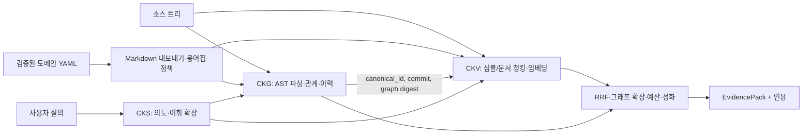

# 『데이터베이스 설계와 구축』 기반 `knowledge-system` 설계 검토

## 결론

`knowledge-system`은 **코드 구조 그래프 + 청크 임베딩 + 키워드 검색 + 질의별 결합**을 이미 상당히 구현했다. 특히 소스 버전과 그래프 다이제스트 정합성, `canonical_id` 조인, 증거 인용, 도메인 지식의 검증 상태는 좋은 토대다. 다음 설계 단계는 데이터베이스 제품을 바꾸는 일이 아니라 **코드·문서·도메인 개념 사이에 의미가 명시된 관계와 검증 가능한 사실을 추가하는 일**이다. 현재의 37종 코드 노드와 43종 관계는 풍부한 *코드 구조 모델*이지만, `related_concepts`가 의미 없는 범용 연결이고 문서가 그래프의 일급 노드가 아니므로 아직 온톨로지 기반 지식그래프라고 보기는 어렵다.

가장 명확히 재현된 결함은 `ckg audit`의 거짓 불일치다. 자체 소스 색인은 877개 Go 빌드 파일을 모두 포함했는데도 감사는 DB에만 1,056개 파일이 있다고 보고하며 종료 코드 1을 반환했다. 그 1,056개 경로의 Go 노드는 전부 과거 변경을 나타내는 `Hunk`였다. 현재 소스 누락은 0건이다.

## 검토 범위와 산출물

| 대상 | 방법 | 결과 |
|---|---|---|
| 스캔 PDF | macOS Vision 한국어·영어 OCR, 전 304쪽 | 전체 전사본 `database-design-and-build-ocr.md`(로컬 자료), [OCR 추출기](./ocr_pdf.swift), 약 21.4만 OCR 문자. 그림·표·코드는 원본 대조 필요 |
| 프로젝트 소스 | 실제 `ckg build`, Go AST 및 TypeScript·Solidity 파서, 문서 구조 파싱, YAML 구조 파싱 | 실제 CKG 인덱스 `ckg-index/graph.db`(로컬 산출물), 검토용 코드·문서 그래프 `knowledge-system-review-graph.sqlite`(로컬 산출물) |
| 측정·검증 | CKG manifest, SQL 집계, `ckg validate`, `ckg audit` | [측정값](./analysis-metrics.json), [검증 결과](./ckg-validation.txt) |
| 기준 리비전 | Git `1ded9b3e47bc2e09062dba329c2f918423746fa4` | 이 리비전의 로컬 소스. PDF는 2026-09-27 제공본 |

실제 CKG 인덱스는 `ckg build --src … --out … --temporal-depth 1`로 만들었다. 출력 약 180 MiB는 재생성 가능하므로 이 검토 폴더의 `.gitignore`에서 제외했다. 별도 검토용 SQLite는 [Go AST 추출기](./build_go_ast_graph.go)와 [문서·YAML 결합기](./build_review_graph.py)로 만들었다. 후자는 분석을 위한 그래프이며 제품의 CKG 스키마나 검색 결과를 대체하지 않는다. Go 호출 관계는 **같은 패키지의 비한정 함수명에 대한 구문상 연결**이어서 타입 기반 호출 확정으로 해석하면 안 된다. Markdown은 코드처럼 컴파일러 AST가 없으므로 제목 계층을 블록 단위로 파싱했고, YAML은 구조화된 노드로 읽었다. Solidity·TypeScript의 AST 분석은 제품의 실제 CKG 빌드에 맡겼다.

| 지표 | 실제 CKG 자체 색인 | 문서 결합 검토 그래프 |
|---|---:|---:|
| 노드 | 87,746 | 12,075 |
| 엣지 | 203,424 | 21,978 |
| 감지 파일 | Go 877, TypeScript 71, Solidity 228, Proto 5 | Go 939, Markdown 223, 도메인 지식 YAML 44 |
| 파싱 오류 / 미해결 참조 | 0 / 0 | Go 구문 오류 0 |

두 그래프의 숫자는 파서와 범위가 달라 직접적인 품질 비교가 아니다. 실제 CKG는 문서를 그래프 노드로 넣지 않고, 검토 그래프는 모든 Go 파일을 구문 분석하며 프로젝트의 파일 선택 규칙을 적용하지 않는다.

## PDF에서 가져온 설계 기준

| PDF 위치 | 설계 기준 | 이 프로젝트에 적용할 판단 |
|---|---|
| 49–57쪽, 79–85쪽 | 컬렉션 경계는 데이터 성격·접근 패턴·규모로 정하고, 벡터와 원천 텍스트·메타데이터를 함께 관리한다. | 코드, 문서, 검증된 도메인 지식은 같은 물리 DB에 두더라도 논리적 `corpus_kind`, `project_id`, `source_commit`으로 구분해야 한다. 물리 분리는 실제 부하를 측정한 뒤 결정한다. |
| 57–78쪽 | 동일 임베딩 공간의 모델·차원·전처리 일관성, 의미 경계를 살린 청킹, 부모·자식 청크가 중요하다. | 현재 심볼·문서 청크 설계는 적절하다. 재색인 시 모델/전처리 버전과 청크 계층을 명시하고 검색은 작은 단위, 인용은 충분한 부모 문맥을 택한다. |
| 92–102쪽 | 검색 적중과 최종 답변의 정합성을 별도로 평가하고, 근거가 없으면 모른다고 답한다. | Recall@K/MRR 외에 **증거가 주장에 맞는지**와 개념 조인의 정확도를 평가한다. |
| 114–140쪽 | 키워드+벡터 결합, 질의 확장, 전후 메타 필터, 부모 문맥 복원이 검색에 기여한다. | 기존 CKV·BM25·RRF·그래프 확장은 방향이 맞다. 메타 필터가 top-K 이후에만 작동하지 않는지 질의 종류별로 측정한다. |
| 151–162쪽 | 그래프는 노드·방향 있는 관계·속성으로 모델링하고, 사실 단위와 계층을 구별한다. | AST 구조 엣지와 **검증 가능한 도메인 사실**을 구별해 저장한다. 문서 섹션과 근거 범위를 그래프에 연결한다. |
| 172–182쪽 | 온톨로지는 개념·관계·제약의 설계이고, 지식그래프는 그 설계에 따른 사실 인스턴스다. 용어 합의, 단순한 핵심 모델, 정책 분리·버전 관리가 중요하다. | 기존 `B1`–`B7`은 지식 *문서 형식* 분류다. 별도의 개념 유형·관계 유형·제약·사실/출처가 필요하다. |

책의 수치 예시나 제품별 성능 주장은 보편 법칙으로 사용하지 않았다. 특히 OCR 전사본의 표, 수식, 코드 조각에는 인식 오류가 있다. PDF 180–185쪽은 한편으로 정책 계층 분리를 권하고 다른 한편으로 온톨로지에 거버넌스를 내장한다고 설명한다. 구현상으로는 **의미 객체가 정책 ID를 참조하고, 정책 정의·판정·감사는 독립적으로 버전 관리**하는 해석이 일관적이다.

### 벡터·그래프·온톨로지 모델링의 구분

벡터 DB의 설계 단위는 **검색할 청크**다. 먼저 어떤 질문에 어떤 원천 단위가 답하는지 정하고, 의미 경계에 따라 분할한다. 각 청크에는 원문과 원천 위치, 프로젝트·코퍼스·버전·접근 범위를 저장한다. 동일 차원·모델·전처리의 임베딩만 한 검색 공간에서 비교한다. 필터 가능한 메타데이터와 어휘 검색을 함께 설계하고, 청크 크기·검색 K·필터 위치를 평가 질문으로 조정한다. 벡터 거리는 후보의 *유사성* 신호이지 코드 호출이나 사실 관계의 증명은 아니다.

그래프 DB의 설계 단위는 **정체성이 있는 노드와 의미가 정해진 관계**다. 어떤 질문을 몇 홉의 어느 방향으로 답할지에서 출발해 노드 유형, 관계 방향, 속성, 동일성 키, 시점과 출처를 정한다. `Function CALLS Function`은 AST/타입 분석에서, `Claim SUPPORTED_BY SourceSpan`은 검증된 문서 근거에서 나온다는 식으로 생성 규칙을 구분한다. 그래프 저장 엔진은 SQLite여도 된다. 중요한 것은 관계의 의미와 무결성이다.

하이브리드 시스템은 두 결과를 단순히 합치는 것보다 **동일 프로젝트·소스 커밋·심볼 키를 확인한 뒤** 벡터 회수 → 정확 검색 → 그래프 확장 → 근거 검증을 수행해야 한다. 온톨로지는 그 위에서 `Concept`, `RelationType`, 허용 대상과 제약을 정의하는 의미 설계이며, 지식그래프는 이 설계에 따라 기록된 구체적 사실이다.

## 현재 구현을 코드에서 추적한 구조



- **그래프:** [실제 스키마](https://github.com/0xmhha/knowledge-system/blob/1ded9b3e47bc2e09062dba329c2f918423746fa4/pkg/graph/types/enums.go#L10)는 심볼·호출·타입·동시성·엔드포인트·커밋·hunk·정책 관계를 폭넓게 표현한다. SQLite의 `nodes`, `edges`, FTS, manifest는 [DDL](https://github.com/0xmhha/knowledge-system/blob/1ded9b3e47bc2e09062dba329c2f918423746fa4/internal/graph/persist/schema.sql#L6)에 있다. 이번 자체 색인에는 10,996개 노드의 비어 있지 않은 `canonical_id`가 있다.
- **벡터:** [청크 타입](https://github.com/0xmhha/knowledge-system/blob/1ded9b3e47bc2e09062dba329c2f918423746fa4/pkg/vector/types/chunk.go#L201)에 파일/라인, 테스트 여부, 청크 종류, 커밋, 내용 해시, `canonical_id`, 카테고리와 불변식 참조가 있다. [SQLite 벡터 저장소](https://github.com/0xmhha/knowledge-system/blob/1ded9b3e47bc2e09062dba329c2f918423746fa4/internal/vector/store/sqlitevec/store.go#L137)가 차원 불일치를 거부한다. 그래프 정렬은 [파일·라인 범위 매칭](https://github.com/0xmhha/knowledge-system/blob/1ded9b3e47bc2e09062dba329c2f918423746fa4/internal/vector/ckgalign/aligner.go#L261)을 사용한다.
- **하이브리드 검색:** [Stage 1](https://github.com/0xmhha/knowledge-system/blob/1ded9b3e47bc2e09062dba329c2f918423746fa4/internal/system/composer/stage1/extractor.go#L40)이 벡터 회수와 어휘 확장, [Stage 2](https://github.com/0xmhha/knowledge-system/blob/1ded9b3e47bc2e09062dba329c2f918423746fa4/internal/system/composer/stage2/merge.go#L10)가 CKV/BM25/심볼 목록을 RRF로 합친다. [Stage 3](https://github.com/0xmhha/knowledge-system/blob/1ded9b3e47bc2e09062dba329c2f918423746fa4/internal/system/composer/stage3/expander.go#L164)가 의도별 관계를 최대 두 홉 확장한다. 이후 예산·정화·인용 패킹으로 이어진다.
- **도메인 지식:** `projects/stablenet`의 44개 항목 중 42개가 `verified`, 2개가 `needs_verification`이다. [항목 타입](https://github.com/0xmhha/knowledge-system/blob/1ded9b3e47bc2e09062dba329c2f918423746fa4/internal/system/inventory/types.go#L81)은 별칭, 코드 앵커, 관련 항목, 검증자와 날짜를 담는다. [내보내기](https://github.com/0xmhha/knowledge-system/blob/1ded9b3e47bc2e09062dba329c2f918423746fa4/internal/system/domainexport/export.go#L18)는 신뢰 가능한 상태만 벡터용 Markdown으로 렌더링하며, 정책 동기화는 검증된 항목만 그래프 정책으로 변환한다.
- **빌드 정합성:** [검증 게이트](https://github.com/0xmhha/knowledge-system/blob/1ded9b3e47bc2e09062dba329c2f918423746fa4/internal/setup/verify.go#L35)가 소스 커밋·그래프 다이제스트·스키마 버전을 비교하고, 버전 데이터셋 승격 전에 구조 검증을 한다.

## 장점

1. **구문 기반 근거:** 심볼·호출·타입·변경 이력을 구조적으로 찾는다. 자연어 유사성만으로 코드를 추측하는 방식보다 호출자/변경 영향 질의에 강한 기반이다.
2. **조인과 재현성:** 그래프/벡터에 같은 코드 정체성(`canonical_id`)과 커밋 좌표를 기록한다. 출처가 다른 색인을 합칠 때의 오류를 막을 수 있다.
3. **검색 다중 신호:** 자연어, 정확한 식별자, 키워드, 관계 탐색을 결합하고 출처를 `EvidencePack`까지 보존한다. 책의 Advanced/Modular RAG 기준에 부합한다.
4. **도메인 지식의 신뢰도 관리:** 초안과 검증본을 구별하고, 앵커·별칭·불변식·위험도를 저장하며 정책과 어휘집을 생성한다. 온톨로지 도입 시 사용할 편집·검증 워크플로가 이미 있다.
5. **운영 장치:** 증분 인덱싱, 버전별 승격·롤백, 평가 시나리오, 경계 검사를 갖춘다. 그래프를 버전 없는 일회성 추출물로 취급하지 않는다.

## 문제와 위험, 우선순위

### P1 — `ckg audit`가 이력 hunk를 현재 파일로 간주

직접 실행한 `ckg audit`의 Go 빌드 파일 877개는 DB에 모두 있었다. 반면 DB의 1,933개 경로 중 1,056개를 초과 파일로 보고했고 이 1,056개에는 `Hunk` 외의 노드가 없었다. [hunk 생성기](https://github.com/0xmhha/knowledge-system/blob/1ded9b3e47bc2e09062dba329c2f918423746fa4/internal/graph/buildpipe/temporal_hunks.go#L438)가 변경 대상의 언어를 `go`로 기록하는데, [파일 집계](https://github.com/0xmhha/knowledge-system/blob/1ded9b3e47bc2e09062dba329c2f918423746fa4/internal/graph/persist/sqlite_reader.go#L84)는 `language='go'`인 **모든 노드**에서 파일 경로를 뽑는다. [감사](https://github.com/0xmhha/knowledge-system/blob/1ded9b3e47bc2e09062dba329c2f918423746fa4/internal/graph/audit/audit.go#L43)는 그 집합을 현재 `go/packages` 파일과 비교한다. 현재 파일 집계는 `type='File'` 또는 현재 빌드 manifest의 파일 집합으로 한정해야 한다. 과거 이력 노드가 많은 정상 그래프에서 감사가 실패해 운영자가 진짜 누락과 거짓 양성을 구분하기 어렵다.

### P1 — 도메인 지식은 저장되지만 의미 관계가 검색 그래프에 약하게 반영됨

`related_concepts`는 ID 목록이며 [검증기](https://github.com/0xmhha/knowledge-system/blob/1ded9b3e47bc2e09062dba329c2f918423746fa4/internal/system/inventory/validate.go#L157)가 존재 여부와 자기 참조만 확인한다. `A DEPENDS_ON B`, `A CONTRADICTS B`, `A VALIDATED_BY test`와 같은 관계 뜻·방향·적용 범위가 없다. 벡터용 [Markdown 내보내기](https://github.com/0xmhha/knowledge-system/blob/1ded9b3e47bc2e09062dba329c2f918423746fa4/internal/system/domainexport/export.go#L87)는 이를 `Related` 텍스트로 적지만, CKG의 일급 의미 관계로 승격하지 않는다. 실제 자기 색인에는 `Policy`/`SecurityPattern` 노드가 0개였다. 이번 빌드에서 관련 옵션을 주지 않았기 때문이며, **기능 부재의 증거는 아니다**. 다만 기본 코드 색인만으로 도메인 개념 추론이 되지는 않는다.

### P1 — 문서와 주장에 대한 그래프 근거가 부족

CKV는 Markdown을 청킹하고 별도 docs root도 읽지만 [그래프 스키마](https://github.com/0xmhha/knowledge-system/blob/1ded9b3e47bc2e09062dba329c2f918423746fa4/pkg/graph/types/enums.go#L12)에는 `Document`, `Section`, `Claim`, `EvidenceSpan`이 없다. 실제 CKG 자체 색인에도 Markdown 언어 노드는 없다. 따라서 벡터로 찾은 설계 문장을 특정 개념·코드 심볼·검증 사실과 연결하거나, 상충하는 문서 버전을 구조적으로 판정하기 어렵다. PDF의 Graph RAG 모델링을 적용하려면 단순 문서 청크 추가보다 **주장-근거-대상 관계**가 필요하다.

### P2 — 위치 기반 조인과 선택적 커버리지 게이트

CKV→CKG 정렬은 정확한 시작 줄에서 출발하지만 [포함·겹침·가까운 이웃](https://github.com/0xmhha/knowledge-system/blob/1ded9b3e47bc2e09062dba329c2f918423746fa4/internal/vector/ckgalign/aligner.go#L289)까지 완화한다. 코드 변경으로 줄 위치가 흔들릴 때 다른 심볼에 결합할 가능성이 있으므로 정확/완화 매칭의 비율을 계측해야 한다. [버전 승격 게이트](https://github.com/0xmhha/knowledge-system/blob/1ded9b3e47bc2e09062dba329c2f918423746fa4/internal/setup/reindex.go#L227)에는 최소 `canonical_id` 커버리지 검사 기능이 있지만, [CLI 기본값 0](https://github.com/0xmhha/knowledge-system/blob/1ded9b3e47bc2e09062dba329c2f918423746fa4/cmd/cks/setupcli/setup.go#L163)은 검사를 끈다. 현재 정합성 게이트가 커밋·다이제스트 불일치를 막는 장점은 별개다. 운영 프로필에는 **매칭 유형별 정밀도와 최소 커버리지**를 명시하는 편이 낫다.

### P2 — 기본 자기 색인의 테스트·픽스처 비중

87,746개 노드 중 `_test.go` 경로 노드가 35,252개, `testdata/` 경로 노드가 2,487개였다. 검증 경고 8건은 모두 Solidity 파서의 테스트 픽스처 6개 파일에서 왔다. 테스트 검색에는 가치가 있으므로 무조건 제외할 이유는 없다. 다만 설계 설명 질의와 테스트 작성 질의는 다른 코퍼스 가중치가 필요하다. Stage 2의 테스트/아카이브 감점은 이미 존재하므로, **질의 의도별 노출과 상위 K의 테스트 점유율**을 평가하면 된다.

### P3 — 문서와 실행 상태의 불일치

[루트 README](https://github.com/0xmhha/knowledge-system/blob/1ded9b3e47bc2e09062dba329c2f918423746fa4/README.md#L5)는 PostgreSQL을 선택 가능 백엔드로 소개하지만 [그래프 README](https://github.com/0xmhha/knowledge-system/blob/1ded9b3e47bc2e09062dba329c2f918423746fa4/graph/README.md#L17)는 이를 deprecated로 규정한다. [벡터 스키마 문서](https://github.com/0xmhha/knowledge-system/blob/1ded9b3e47bc2e09062dba329c2f918423746fa4/docs/vector/SCHEMA.md#L8)는 CKG 1.7을 적고, 실제 manifest는 1.23이다. [도메인 스키마 문서](https://github.com/0xmhha/knowledge-system/blob/1ded9b3e47bc2e09062dba329c2f918423746fa4/system/docs/domain-knowledge/shared/SCHEMA.md#L47)의 `source_of_truth` 허용값도 [검증 코드](https://github.com/0xmhha/knowledge-system/blob/1ded9b3e47bc2e09062dba329c2f918423746fa4/internal/system/inventory/validate.go#L123)보다 좁다. 책의 메타데이터 일관성 원칙처럼 코드에서 생성 가능한 버전·enum 표는 자동 생성 또는 문서 검사에 포함시키는 편이 좋다.

## 온톨로지 도입안

온톨로지는 `related_concepts`를 복잡한 문자열로 바꾸는 정도로 끝나지 않는다. **개념 유형과 관계 유형을 정의하는 스키마**, **그 스키마에 맞는 사실**, **사실을 지지하는 근거**, **적용되는 버전과 정책**이 분리되어야 한다. W3C의 [OWL 2 입문서](https://www.w3.org/TR/owl-primer/)는 클래스·속성·개체의 구분을 설명하고, [SHACL](https://www.w3.org/TR/shacl/)은 데이터 그래프를 별도 제약 그래프로 검증하는 방식을 정의한다. 여기서는 처음부터 RDF 저장소나 추론기를 도입할 필요 없이 같은 개념을 SQLite/YAML의 작은 의미 계층에 적용할 수 있다.

### 1. 작은 핵심 어휘를 합의

| 종류 | 최소 정의 | 예 |
|---|---|---|
| `Concept` | 프로젝트 내 안정적 의미 ID, 정의문, 포함/제외 범위 | `consensus:QuorumThreshold` |
| `ConceptType` | `Subsystem`, `Algorithm`, `Invariant`, `Procedure`, `DataStructure` 등 | `Invariant` |
| `RelationType` | 방향·시작/끝 타입·역관계·추이성·증거 요구 | `ENFORCED_BY: Invariant → CodeSymbol` |
| `Term` | 언어별 표기, 동의어, 검색용 별칭 | `쿼럼 크기`, `quorum size` |
| `Assertion` | 실제 관계 한 건, 상태와 유효 기간 | `QuorumThreshold ENFORCED_BY defaultSet.QuorumSize` |
| `Evidence` | 소스 파일·라인·커밋, 문서 섹션, 검증자 | `default.go:226@commit` |
| `Policy` | 버전 있는 허용/차단/우선순위 규칙 | `verified 주장만 answer 근거로 허용` |

현재 `B1`–`B7`은 *질문에 답하는 글의 모양*이므로 유지한다. `B3` 항목이 `Algorithm` 개념을 서술할 수도, `B4` 불변식을 동시에 포함할 수도 있다. 이 둘을 같은 타입 체계로 합치지 않는다. 모든 개념에 영구 ID와 자연어 정의를 부여하고, 코드 `canonical_id`는 구현 앵커로 연결한다. 코드 식별자가 바뀌어도 개념 ID는 유지한다.

### 2. 기존 YAML에 의미 관계를 점진적으로 추가

```yaml
id: A1.wbft_core.quorum_calc
knowledge_type: B3
concept_id: consensus:QuorumThreshold
relations:
  - predicate: ENFORCED_BY
    target: code:defaultSet.QuorumSize
    evidence:
      file: consensus/wbft/validator/default.go
      symbol: defaultSet.QuorumSize
    status: verified
  - predicate: DEPENDS_ON
    target: consensus:ValidatorSetSize
    status: verified
```

이 예시는 새 스키마 제안이며 현재 YAML에 적용된 데이터가 아니다. `target`은 문자열 이름만으로 해석하지 말고 프로젝트 ID와 코드 `canonical_id`로 확인한다. `predicate`별 시작/끝 타입과 증거 의무를 검증하며, 추출기 추측 관계는 `proposed`, 사람이 확인한 관계는 `verified`로 분리한다. 기존 `related_concepts`는 마이그레이션 동안 `RELATED_TO`로만 남겨 검색 가중치를 낮춘다.

### 3. 문서와 코드에 대한 증거 연결

`Document → Section → Claim → EvidenceSpan` 구조를 의미 오버레이로 만든다. Markdown 섹션과 YAML 항목을 청크 ID로 연결하고, `Claim ABOUT Concept`, `Claim SUPPORTED_BY EvidenceSpan`, `Concept IMPLEMENTED_BY CodeSymbol`, `Test VALIDATES Claim` 같은 방향 있는 관계를 허용한다. 문서 페이지·파일·줄·커밋·추출 방식·신뢰 상태를 각 사실에 저장한다. 문서와 코드가 다른 커밋을 말하면 최신 것이라는 이유만으로 덮어쓰지 않고 충돌로 표시한다.

우선은 기존 SQLite 그래프 위에 별도 `ontology_*` 테이블 또는 sidecar DB로 구현해 코어의 37/43 enum을 한 번에 늘리지 않는다. 조회 인터페이스에서만 연결하고, 성공한 관계 종류부터 CKG 스키마에 승격한다. 개념과 관계 타입에는 유일키, FK, 타입/도메인 제약, 유효 기간, 삭제 정책을 둔다. `Concept`와 `Term`은 버전 관리하고, 사실은 `source_commit`, `valid_from`, `valid_to`, `reviewed_by`, `confidence`를 저장한다.

### 4. 검색 파이프라인에 넣는 순서

1. **질문 해석:** 용어집이 후보 개념을 제시하고, 동음이의어는 명확화 또는 복수 후보로 유지한다. 개념 정의의 포함/제외 범위를 사용한다.
2. **회수:** 기존 벡터·BM25·심볼 검색을 유지하되 프로젝트, 소스 버전, 코퍼스 종류, 접근 범위를 먼저 제한한다.
3. **조인:** CKV 결과를 `canonical_id`나 명시된 `chunk_id`로 CKG에 연결한다. 위치 추정 매칭은 별도 신뢰 등급을 붙인다.
4. **의미 확장:** 의도와 개념 유형에 따라 허용된 관계만 제한된 홉으로 탐색한다. `RELATED_TO`는 답의 근거가 아니라 후보 확장용으로만 쓴다.
5. **검증:** assertion의 타입·시간·증거·정책을 검사한다. 확인되지 않은 관계로 최종 주장을 만들지 않는다.
6. **패킹:** 기존 EvidencePack에 개념 ID, 관계 경로, 근거 출처와 검증 상태를 더해 사용자에게 왜 그 코드가 선택됐는지 설명한다.

### 5. 단계별 수용 기준

| 단계 | 구현 | 통과 기준 |
|---|---|---|
| A | `ckg audit` 파일 집계 수정, 정합성 기본 게이트 설정 | 같은 자체 색인에서 감사 877/877 일치; 잘못 연결된 `canonical_id` 사례 0 |
| B | 핵심 어휘와 typed relation을 10–20개 고가치 항목에 도입 | 타입/역방향/증거 제약을 검증하고, 모호한 `RELATED_TO`와 구별 가능 |
| C | 문서 섹션·claim·근거 연결 | 대표 질문마다 코드 또는 문서의 정확한 범위를 인용, 버전 충돌을 표시 |
| D | 온톨로지 유도 검색과 기존 검색의 A/B 평가 | Recall@K, MRR, 관계 조인 정밀도, 답변 근거성, p95 지연, 테스트 노출률을 함께 비교 |
| E | 정책·권한·시간 범위 | 허용되지 않은 사실/과거 사실이 답에 섞이지 않고, 정책 버전별 결과 재현 가능 |

평가 집합에는 **같은 이름의 다른 심볼**, 한국어 별칭 충돌, 코드와 문서가 다른 버전을 설명하는 사례, 관련 문서가 아예 없는 질문을 반드시 넣는다. 온톨로지가 검색 품질을 실제로 높이는지 확인되기 전에는 관계 수를 늘리는 것을 성공 지표로 삼지 않는다.

## 검증과 한계

실제 CKG 인덱스는 파싱 오류와 미해결 참조가 0개였다. `ckg validate`는 오류 0건, 경고 8건이며 전부 Solidity 테스트 픽스처 6개 파일에 속한다. `ckg audit`의 초과 1,056개 경로가 모두 `Hunk` 전용임을 SQL로 확인했다. OCR은 304/304쪽 모두 텍스트를 반환했고 페이지별 평균 신뢰도 중앙값은 0.860이다. 낮은 신뢰도의 PDF 1, 10, 83, 122, 127, 138, 243쪽은 수치·코드 인용 시 원본 확인이 특히 필요하다.

이 검토에서 **실제 CKV 임베딩 색인과 CKS의 종단 간 검색 품질은 실행하지 않았다**. Ollama 모델과 프로젝트용 데이터셋을 구성하지 않았으므로 현재 배포의 Recall/MRR이나 답변 정확도를 보증할 수 없다. 자체 색인은 옵션 없이 만든 CKG 데이터이며 운영 팩의 정책·보안 패턴 반영 여부를 대표하지 않는다. 따라서 위 품질 위험은 코드와 실제 그래프 구조에 근거한 설계 판단이고, 성능 개선 폭은 A/B 평가로 입증해야 한다.
