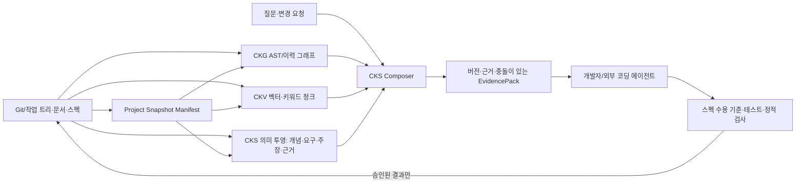

# Knowledge System 확장 기술 설계 v0.1

작성일: 2026-09-29 · 소스 기준: `main` @ `1ded9b3e47bc2e09062dba329c2f918423746fa4` · 상태: 구현 전 제안

[요구사항 명세](./spec-driven-requirements.md)의 ID를 설계 계약으로 사용한다. [분석 문서](./ckv-ckg-ontology-installation-proposal.md)의 PDF 원문 대조는 동기와 방향을 제공하지만, 아래 인터페이스·테이블·알고리즘은 PDF에 쓰인 현행 기능이 아니라 **제안**이다. 실제 스키마와 CLI 이름은 구현 작업에서 기존 공개 계약과 충돌하지 않도록 확인한다.

## 1. 권장 경계와 데이터 흐름

**추천 배치:** 온톨로지는 CKS의 공유 의미 계약과 투영 저장소로 둔다. 개념 정의·별칭은 CKV 검색 가능한 텍스트로 투영하고, 타입 관계·추적성은 CKG 코드 앵커와 연결한다. 물리 DB 하나에 모두 밀어 넣거나 그래프 위의 추론 계층만으로 한정하지 않는다. 초기에는 검토 가능한 YAML/Markdown을 원본으로, CKS 소유 SQLite 의미 인덱스를 파생물로 사용한다. CKG의 기존 AST enum을 의미 객체마다 늘리지 않는 것이 변경 표면을 줄인다. 장기적으로 CKG 내부에 통합할지는 성능·운영 비용 측정 후 결정한다.

**현재/제안 구분:** 현행 Composer는 분류→CKV 후보→CKG/BM25 재순위→그래프 확장→예산/정화→EvidencePack으로 이어진다. 제안 경로는 개념 후보·의미 투영·충돌 판정을 여기에 삽입한다. 기존 검색 경로를 유지한 채 기능 플래그와 A/B 비교로 도입한다. CKS는 현재 코드 패치를 자율 수행하지 않는다.

## 2. 스냅샷과 증거 계약

`DatasetManifest` 제안 필드: `project_id`, `dataset_id`, `source_mode(committed|working-tree)`, `git_commit`, `file_manifest_digest`, `graph_digest`, `vector_digest`, `semantic_digest`, `embedding_identity`, `ontology_version`, `policy_version`, `schema_versions`, `build_time`, `capabilities`. `working-tree`에서 수정·신규 파일의 정규화 경로와 내용 해시를 매니페스트에 포함한다. 비밀·제외 파일은 해시 목록에도 무분별하게 노출하지 않고 제외 정책 결과만 안전하게 기록한다. 해시 알고리즘, 경로 정규화, 심볼릭 링크 경계는 W5.2에서 고정한다.

모든 `EvidenceRef`는 `project_id`, `dataset_id`, `source_kind`, `path`, `content_digest`, `start_line`, `end_line`, `canonical_id?`, `chunk_id?`, `extractor`, `confidence/status`를 가진다. 원천 위치가 없는 LLM 주장에는 `verified`를 허용하지 않는다. CKV 청크와 CKG 심볼의 `canonical_id` 정렬이 실패하면 위치/본문을 명시적으로 재검증한 결과만 제한적으로 연결하고 실패를 계측한다. `--gate-min-canonical`의 현행 기본 0을 즉시 임의 숫자로 바꾸지 않고 기준선을 측정한 후 프로젝트 프로필별 게이트를 정한다.

승격 순서: 비활성 버전 빌드 → 그래프 감사/벡터 커버리지/의미 제약/질문 평가 → 매니페스트 서명 또는 해시 검증 → `current` 원자 전환. 일부 단계가 실패하면 이전 `current`를 유지한다. 서버가 기존 데이터셋 핸들을 시작 시 유지하는 현행 구조에서는 전환 후 재시작/명시적 재연결을 운영 계약에 포함한다. 핫스왑은 별도 후속 설계다. (INV-01/02/03/07, FR-10)

## 3. CKV: 필터 계획과 문서 청킹

### 3.1 선택도 기반 검색 (FR-02)

현재 일반 필터 경로는 전역 KNN 상위 약 `3K`를 가져와 필터링한다. 제안 알고리즘은 먼저 필터 조건의 허용 후보 수를 추정한다.

1. `project_id`/스냅샷/접근 범위를 항상 필수 필터로 적용한다. 필터 식의 의미를 언어·경로·커밋·종류·제외 목록에 대해 명시한다.
2. 후보 수가 작고 정확 계산 비용이 예산 안에 있으면 필터된 후보 집합에서 정확 거리 계산·정렬을 한다. 저장소가 제공하는 희귀 `ChunkKinds` 특수 경로와 의미를 맞춘다.
3. 후보 수가 크면 전역 ANN/벡터 검색을 단계적으로 넓힌다. 후보가 K개 미만으로 남으면 필터된 정확 계산으로 보충해 정상 응답의 K개 계약을 지킨다. 시간·메모리 상한 때문에 보충도 끝나지 못했다면 `incomplete`, `eligible_count`, `searched_candidates`를 반환해 정상 성공 또는 정확한 K개라고 주장하지 않는다.
4. 대상 DB와 sqlite-vec의 SQL 제한, 필터 인덱스, 거리 계산 비용을 실험한 뒤 이 둘 중 구현을 고른다. 후보 인덱스 분할은 비용 대비 효과가 있을 때만 도입한다.

검증은 작은 픽스처의 완전 탐색 결과를 오라클로 두고, 큰 실제 코퍼스에서는 필터된 정확 검색 샘플과 동일 질의를 비교한다. 근사 검색은 수학적으로 상위 K를 보장하지 않으므로 “K개 반환”과 “정답 K개 회수”를 별도 지표로 둔다. 시간 초과·상한 도달을 숨기지 않는다. 필터가 없는 기존 질의의 지연과 결과도 회귀 비교한다.

### 3.2 부모·자식 문서 청크 (FR-03)

현재 Markdown 파서의 제목 섹션을 `parent`로 보존하고, 긴 섹션을 단락/목록/코드 블록 경계의 `child`로 나눈다. 너무 긴 단일 블록은 줄 경계에 따라 분할하고 필요한 최소 겹침만 허용한다. 각 child는 `parent_id`, `heading_path`, `ordinal`, 원문 `start_line/end_line`, 본문 해시를 가진다. 임베딩 텍스트에는 제목 조상과 제한된 문맥을 포함하되, 인용은 child의 원문 범위만 사용한다. 검색 결과 표시에서는 부모 제목과 인접 child를 예산 내에서 확장한다. 같은 문단이 여러 검색 결과에 중복되면 묶어 토큰 낭비를 막는다.

데이터 마이그레이션은 새 청크 스키마 버전으로 전체 재색인을 기본 경로로 한다. 짧은 섹션은 기존 출력/ID 호환을 최대한 유지하되, 안정 ID 규칙이 바뀌면 매니페스트 버전으로 명시한다. PDF 79쪽의 책 구조 예시는 계층 청킹을 설명하는 근거이며, 코드 문서의 최적 길이·겹침은 평가 결과로 정한다.

## 4. CKG와 의미 투영: 사실의 경계

CKG 감사는 `File` 노드 또는 현재 파일 매니페스트로 **현재 AST 파일 집합**을 집계하도록 수정한다. Git 이력 `Hunk`가 언급하는 파일은 감사 기준의 현재 파일이 아니다. 과거 변경 탐색에는 그대로 남긴다. 이 수정은 의미 투영보다 앞선 Gate 0이다. (FR-01)

제안하는 의미 투영의 최소 논리 스키마:

| 객체 | 필수 필드 | 비고 |
|---|---|---|
| `Concept` | `concept_id`, 정의문, 범위, 상태, 버전 | 타입은 `Subsystem`, `Invariant`, `API`, `Data`, `PolicyTerm` 등 최소 세트부터. 도메인 세부 분류는 프로젝트 팩. |
| `Term` | 언어, 표기, `concept_id`, preferred/alternative | 동일 표기가 복수 개념에 연결될 수 있음. |
| `Requirement` / `AcceptanceCriterion` | 안정 ID, 원천 범위, 버전, 상태 | 미구현 상태도 유효한 스펙. 코드 앵커를 필수로 하지 않음. |
| `DocumentSection` / `Claim` | 원문 범위, 문장/해시, 추출 방법 | LLM 추출은 기본 `proposed`. 문서 종류 `B1–B7`과 개념 타입을 혼동하지 않음. |
| `Assertion` | 주체, 관계, 객체, 근거, 상태, 유효 스냅샷 | 관계 타입·방향·원천 요구를 스키마로 검증. |
| `EvidenceSpan` | 문서/코드/테스트 위치와 다이제스트 | 오래되거나 삭제된 원천은 검증 근거로 사용 불가. |
| `PolicyRef` | `policy_id`, version | 구조는 정책을 참조하되 판정 로직은 별도 버전. |

관계 예시: `Requirement SPECIFIES Concept`, `Concept IMPLEMENTED_BY CodeSymbol`, `Invariant ENFORCED_BY CodeSymbol`, `AcceptanceCriterion VALIDATED_BY TestCase`, `Claim ABOUT Concept`, `DocumentSection SUPPORTS Claim`. 모든 관계에는 허용된 시작/끝 타입, 방향, 근거 종류, `verified` 승격 규칙을 둔다. `RELATED_TO`는 가중치가 낮은 후보 연결이며 결론의 유일한 근거로 쓰지 않는다. 코드가 스펙과 다르면 `CONTRADICTS` 또는 검토 과제로 표시하고 자동 해소하지 않는다. (FR-05/06)

검증은 JSON Schema 등으로 문서 형식을 검사하고, 관계 제약/고아 노드/스냅샷 일치/근거 유효성을 별도 규칙으로 검사한다. W3C SKOS의 선호·대체 표기, SHACL의 데이터/제약 분리에서 아이디어를 얻지만 첫 버전에서 RDF/OWL 추론 엔진을 의무화하지 않는다. 필요성이 입증되면 교환 형식/제약 언어를 추가한다. [SKOS](https://www.w3.org/TR/skos-primer/), [SHACL](https://www.w3.org/TR/shacl/).

## 5. CKS 질의와 통합 개발 흐름

`QueryContext`는 `raw_query`, 프로젝트/스냅샷, 검색 필터, `concept_candidates[]`를 함께 보유한다. CKV 자연어 검색, BM25, 정확 심볼 검색을 먼저 수행하고, 개념 별칭과 verified 관계를 **재순위/제한된 확장**에만 쓴다. CKG 관계 확장은 홉·노드·시간·토큰 예산을 갖는다. 어떤 후보도 개념 미등록만으로 탈락하지 않는다. 답변은 `supported`, `insufficient_evidence`, `source_missing`, `spec_code_conflict`, `snapshot_mismatch` 중 상태를 출력한다. 기존 EvidencePack 필드는 보존하고 상태·근거 경로를 추가한다. (FR-04/07)

읽기 전용 개발 루프는 `ChangeRequest → Requirement/AcceptanceCriterion → 개념·불변식 후보 → CKV/CKG 근거 → 추적성 그래프 → 변경 계획/영향 범위 → 외부 변경 결과 검증`이다. 추적 경로의 각 변은 `verified/proposed/missing/conflicting` 상태를 보인다. 테스트 결과는 명시된 환경·커밋·명령과 묶는다. 승인된 변경 뒤 새 스냅샷을 만들고 전체 질의·수용 기준을 다시 평가한다. 모델 기반 개발의 구조 모델, 스펙 기반 개발의 명시적 수용 기준, 지식 데이터 기반 개발의 현재 근거가 각각 다른 역할을 한다. (FR-08)

## 6. 설치형 아키텍처

첫 배포물은 현행 실행 구조에 맞춰 `cks`, `ckg`, `ckv` 세 바이너리와 버전·체크섬·기본 템플릿을 함께 제공한다. `cks doctor`는 OS/CPU/CGO/SQLite 확장/임베더/쓰기 권한/언어 파서를 검사한다. `cks init`은 소스·제외 경로·문서·스펙 위치·프로젝트 ID를 기록하고 소스 저장소를 기본적으로 수정하지 않는다. `cks index`는 `setup`을 감싸 새 데이터셋을 검증·승격한다. `cks status`는 기능별 지원 수준, 누락 파일, 버전, 커버리지, 모델 정체성을 공개한다. `serve`는 활성 스냅샷만 연다. 기존 `cks setup`과 `mcp gen-config`의 동작은 유지하고 편의 명령을 추가하는 방향이다. 정확한 옵션 이름은 CLI 충돌 검토 뒤 확정한다. (FR-09/10)

언어 어댑터의 능력은 `text`, `symbol`, `AST`, `call`, `type`, `citation`처럼 단계별로 선언한다. 파서 오류나 미지원 언어는 텍스트 검색으로 낮추고, AST 경로가 없다고 명시한다. 프로젝트 격리는 저장 디렉터리, 검색 필터, 서버 권한, 캐시 키, 평가 리포트 전부에 적용한다. 다운로드가 필요한 임베더와 오프라인 환경은 설치 프로필로 분리한다. 그래프 전용 설치는 가능하지만 벡터 의미 검색 기능을 표시하지 않는다.

## 7. 설계 결정, 대안, 보류

| 결정 | 선택 이유 | 대안/전환 조건 |
|---|---|---|
| 작은 CKS 의미 저장소 + CKV/CKG 투영 | 기존 AST 그래프와 벡터 엔진의 안정성을 보존하면서 공유 계약을 둠 | 그래프 DB 통합은 중복·조인 비용이 실제 병목일 때 검토. |
| 소프트 개념 매칭 | 새 표현의 검색 회수율을 보존 | 엄격 필터는 명시적 사용자 범위 조건에만 사용. |
| 파일 원본, DB 파생 | 리뷰·버전·롤백과 설치 이동성 | 편집자·규모가 커지면 API 원본 저장소 검토. |
| 단계별 기능 플래그 | 기존 질의 계약을 유지하며 A/B 가능 | 평가 게이트 통과 후 기본 활성화. |
| 프로젝트별 품질 임계치 | 언어·문서 밀도·임베더 차이를 반영 | 데이터셋 확정 전에 전역 절대치를 발명하지 않음. |

**보류할 것:** 전체 문장 자동 사실화, 무근거 LLM 관계의 자동 승격, 모든 질문에 대한 GraphRAG 커뮤니티 요약, 전 언어 동일 AST, 자동 코드 패치, 서비스 핫스왑, RDF/OWL 전면 도입. 각각은 사용 사례·품질/비용 실험·운영 필요가 생길 때 별도 스펙으로 판단한다.

## 8. 주요 실패와 방어선

| 실패 모드 | 방어/관찰 |
|---|---|
| CKV 필터 오차 | 정확 오라클·선택도별 회수율·불완전 결과 신호 |
| 청크 줄 범위 오류 | 소스 역추적 테스트·부모/자식 경계 픽스처 |
| `verified` 허위 관계 | 타입·출처·승인 상태 검증·관계 샘플 감사 |
| 스냅샷 혼합 | 매니페스트 조인 계약·원자 승격·롤백 |
| 자연어 회수율 저하 | 원문 쿼리 경로 유지·온톨로지 ablation |
| 과도한 지연/저장 공간 | 홉·후보·토큰 예산과 p95/크기 기준선 비교 |
| 임의 프로젝트 실패 | `doctor`의 능력 보고·미지원 경로 스모크 테스트 |

수치 목표와 완료 게이트, 작업 의존성은 [WBS](./spec-driven-wbs.md)에 둔다.
