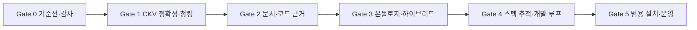

# Knowledge System 스펙 기반 개발 계획과 WBS v0.1

작성일: 2026-09-29 · 기준: `main` @ `1ded9b3e47bc2e09062dba329c2f918423746fa4` · 상태: 구현 전 작업 계획

연결 문서: [PDF 대조를 포함한 분석](./ckv-ckg-ontology-installation-proposal.md) · [요구사항](./spec-driven-requirements.md) · [기술 설계](./spec-driven-architecture.md).

## 1. 실행 원칙과 완료 정의

각 작업은 **요구사항/시나리오 지정 → 실패 재현 또는 기준선 → 최소 변경 → 단위·통합 테스트 → 관련 회귀 → 평가 비교 → 문서·매니페스트 갱신** 순서로 수행한다. 기능을 한꺼번에 켜지 않고 단계별 기능 플래그, 비활성 데이터셋 빌드, 승격 게이트로 확장한다. 구현 PR은 해당 FR/INV/NFR ID, 변경 파일, 오라클, 실행 환경, 전후 수치, 남은 위험을 기록한다.

**완료 정의(DoD):** 명세의 정상·오류·버전·프로젝트 격리 시나리오 통과, `go test ./...`, 관련 경우 `go test -race ./...`, `go vet ./...`, `make boundaries`, `make docs-check`, 실제 `cks/ckg/ckv` 통합 스모크, 평가셋 비교, 스키마 마이그레이션/롤백 검증. 모든 게이트를 매 PR마다 무조건 전체 반복하지 않는다. 해당 코드 경로의 직접 테스트는 매 변경, 전체 게이트는 단계 승격 전 수행한다. 새 실패는 테스트와 스펙에 먼저 반영한다. 통과 범위를 정확히 적고 “사이드 이펙트 없음”이라는 무제한 보증은 하지 않는다.

**품질 임계치 결정:** Phase 0에서 모델·코퍼스·질문·하드웨어·허용 오차를 고정한다. 검색 품질은 Recall@K/MRR, 답변은 주장별 근거 적합도·기권 정확도, 그래프는 관계 정밀도·경로 유효성, 운영은 p95·크기·빌드 시간·실패율을 분리한다. 새 기능의 품질 이득이 비용·지연·오류를 감당하는지 단계 게이트에서 판단한다. 정량 임계치를 기준선 없이 임의 설정하지 않는다.

## 2. 단계와 의존성

W1과 W2의 일부 설계/픽스처 작성은 병렬 준비할 수 있지만 새 의미 관계의 활성 승격은 CKV 인용·CKG 감사 신뢰성이 확보된 후다. 설치형 패키지 설계는 일찍 시작해도 배포 승격은 스냅샷·롤백 계약이 통과한 뒤다. 즉, 기능 순서는 **정확성 → 검색 → 근거 → 온톨로지 → 개발 루프 → 설치형**이다.

## 3. WBS

공수는 **한 명의 숙련된 Go 엔지니어가 기존 코드를 이해한 후 수행하는 엔지니어 일수의 거친 범위**다. 병렬 작업, 모델 다운로드·인프라 지연, 도메인 전문가 승인, 외부 배포 심사는 포함하지 않는다. 탐색에서 구조가 달라지면 각 단계 게이트에서 재산정한다. 숫자는 일정 약속이 아니다.

| WBS | 작업 및 산출물 | 선행 | 관련 계약 | 검증·완료 증거 | 예상 일수 |
|---|---|---|---|---|---:|
| **W0** | **기준선과 현재 오류 교정** | — | — | Gate 0 | **6–10** |
| W0.1 | 현재 CLI/MCP/DB 스키마와 평가셋 고정; CKV+CKG+CKS 실제 종단 간 기준선, 임베더 정체성·기계·커밋 기록 | — | INV-02/06/07, NFR-01 | 재실행 가능한 명령·매니페스트·Recall/MRR/지연 리포트 | 2–3 |
| W0.2 | 과거 `Hunk` 오집계 재현 테스트와 `ckg audit` 현재 파일 기준 수정 | W0.1 | FR-01 | 과거 파일 픽스처와 대상 저장소 감사 일치; 역사 검색은 보존 | 1–2 |
| W0.3 | 프로젝트/스냅샷 조인과 CKV↔CKG `canonical_id` 정렬률 계측; 필터 정확 오라클·긴 문서·답 없음 평가 입력 생성 | W0.1 | INV-01/02, FR-02/03/04 | S-01/02/04/07/09 실행 가능, 정렬률·완화 매칭률과 재현 데이터 고정 | 2–3 |
| W0.4 | 답 없음 평가의 현행 점수 특례를 별도 기권 규칙으로 분리하는 스펙/테스트 | W0.3 | FR-04 | 무관 인용 단정은 실패, 정답 질문 점수 유지 | 1–2 |
| **W1** | **CKV 검색 정확성과 문서 회수** | W0 | — | Gate 1 | **10–19** |
| W1.1 | 필터 의미·선택도/오라클 픽스처·계측 계약 확정 | W0.3 | FR-02, INV-01 | 필터식별 기대 후보 집합·상한 시 처리 정의 | 1–2 |
| W1.2 | CKV 조건별 정확 스캔/적응형 후보 증량 구현 | W1.1 | FR-02 | S-01 K개 반환, exact 대비 Recall@K, 빈/모순 필터 테스트 | 3–5 |
| W1.3 | 무필터 회귀·p95/크기 측정 및 불완전 검색 상태 노출 | W1.2 | NFR-01 | 기존 경로 결과/지연 비교, 상한 도달 시 명시 | 1–2 |
| W1.4 | Markdown 부모/자식 청크와 안정 ID·원문 줄 계약 | W0.3 | FR-03, INV-03 | 경계/코드 블록/목록 골든 테스트 | 1–2 |
| W1.5 | 청크 생성·부모 문맥 재구성·중복 제거·재색인 | W1.4 | FR-03 | S-02 끝 단락 검색/인용; 짧은 문서 호환 | 2–4 |
| W1.6 | 청킹 A/B 및 재색인/롤백 검증 | W1.5 | NFR-01/03 | Recall·토큰·저장 크기·줄 범위 비교 | 1–2 |
| W1.7 | 검색/근거/기권 평가 리포트를 분리해 종단 간 실행 | W0.4, W1.3, W1.6 | FR-04 | S-04 무근거 단정 검출, 정답 질문 성능 유지 | 1–2 |
| **W2** | **문서·코드 증거 연결** | W1 | — | Gate 2 | **8–14** |
| W2.1 | `DocumentSection/Claim/EvidenceSpan` 최소 스키마, 원천/버전 ID 규칙 | W1.6 | FR-05, INV-03/04 | 제약·마이그레이션·삭제/구버전 처리 설계 리뷰 | 2–3 |
| W2.2 | Markdown/스펙 섹션 추출과 AST 앵커 연결, `proposed` 기본값 | W2.1 | FR-05 | S-05 원천 줄 재현, 고아/잘못된 앵커 거부 | 3–5 |
| W2.3 | 근거·관계 샘플 검토 도구와 정밀도 평가셋 | W2.2 | FR-05, NFR-03 | 잘못된 관계 비율·검토 비용 리포트 | 1–2 |
| W2.4 | 동일 스냅샷의 CKV/CKG/문서 참조 조인, 기존 EvidencePack 호환, 측정된 프로젝트별 정렬률 승격 게이트 | W2.2, W0.3 | INV-01/02/06 | S-07/09 혼입 0, 기존 소비자 계약 테스트, 기준 미달 승격 차단 | 2–4 |
| **W3** | **도메인 온톨로지와 하이브리드 검색** | W2 | — | Gate 3 | **9–15** |
| W3.1 | 능력 질문, 10–20개 시범 개념, 문장형 정의·포함/제외·별칭과 검토 기록 | W2.1 | FR-06 | 도메인 전문가 리뷰, 모호/중복 용어 목록 | 2–3 |
| W3.2 | 개념/요구/관계/정책 참조 스키마, 타입·상태·근거 검증 | W3.1 | FR-06, INV-04 | 잘못된 타입·무근거 `verified`·구버전 참조 거부 | 2–4 |
| W3.3 | 파일 원본→의미 SQLite 및 CKV 텍스트 투영, 버전 마이그레이션/롤백 | W3.2 | FR-06, NFR-03 | 재빌드 결정성·이전 버전 재현 | 2–3 |
| W3.4 | CKS 복수 개념 후보·소프트 재순위·무온톨로지 폴백 | W3.3 | FR-07, INV-05 | S-06 기본 후보 보존; concept-only/graph-only/결합 ablation | 2–3 |
| W3.5 | 품질·지연·오개념 확정률 평가와 기본 활성 여부 결정 | W3.4 | FR-07, NFR-01 | 질문군별 전후 표, 기준 미달 시 플래그 비활성 | 1–2 |
| **W4** | **모델·스펙·근거 통합 개발 흐름** | W3 | — | Gate 4 | **9–16** |
| W4.1 | `Requirement/AcceptanceCriterion` 입력 형식과 스펙 상태/버전/미구현 계약 | W3.2 | FR-08 | 코드 없는 스펙 저장; 오류/중복 ID 검사 | 2–3 |
| W4.2 | Requirement→Concept→Code→Test 추적, 누락·상충·오래된 근거 리포트 | W4.1, W2.4 | FR-08 | S-05/07 경로와 충돌 재현, 잘못된 확정 없음 | 3–5 |
| W4.3 | 읽기 전용 변경 계획과 외부 에이전트용 EvidencePack 확장 | W4.2 | FR-08, INV-06 | 기존 팩 필드 호환, 영향 범위/근거/미확인 표시 | 2–4 |
| W4.4 | 외부 패치의 수용 기준·테스트 결과 수집 및 재색인 흐름 | W4.3 | FR-08, INV-02 | 실패 패치 미승격, 성공 결과도 스냅샷 연결 | 2–4 |
| **W5** | **설치형 일반화와 배포** | W4 | — | Gate 5 | **9–16** |
| W5.1 | 세 바이너리 플랫폼별 패키징, 버전/체크섬/의존성 목록 | W0.1 | FR-09 | 지원 OS/CPU 매트릭스 빌드·실행; 배포 라이선스 확인 | 2–3 |
| W5.2 | `doctor/init`·언어 능력 탐지·제외/비밀 경로 정책·프로젝트 격리 | W2.4 | FR-09, NFR-02/04 | S-07, 미지원 언어, 권한/심볼릭 링크 실패 스모크 | 2–4 |
| W5.3 | `committed`/`working-tree` 매니페스트와 변경 파일 다이제스트 | W5.2, W3.3 | FR-10, INV-02 | S-08 같은 HEAD의 다른 내용이 다른 데이터셋 | 2–3 |
| W5.4 | `index/status/serve/rollback` 사용 흐름, 서비스 재시작 계약 | W5.3, W4.4 | FR-09, INV-02 | S-09 실패 승격·롤백·재시작 뒤 인용 일치 | 2–4 |
| W5.5 | 빈 Go/TS/미지원 언어 저장소의 설치→질의 스모크, 문서/CLI 정합성과 Composer 순차 흐름 문서 수정 | W5.4 | FR-09, NFR-05 | 새 저장소 수동 코드 수정 없이 실행; 지원 수준 및 실제 흐름 표시 | 1–2 |

각 단계의 합계는 하위 작업 공수의 단순 합인 개략치다. 전체는 약 **51–90 엔지니어 일**로 본다. 상한이 커지는 주된 변수는 임베더/네이티브 패키징, 기존 스키마 호환, 도메인 관계 검토다. 단계 게이트에서 실제 작업량으로 재산정한다.

## 4. 단계별 승격 게이트

| 게이트 | 필수 산출물과 질문 | 통과 기준 / 실패 시 조치 |
|---|---|---|
| Gate 0 | 기준선 리포트, 정확 검색 오라클, `ckg audit` 회귀 픽스처 | 현재 파일 감사 일치; CKV+CKS를 실제 실행해 품질/지연 측정. 임베더가 없어 실행 불가하면 그 사실과 막힌 항목을 기록하고 검색 품질 개선의 승격은 보류. |
| Gate 1 | 필터 검색·계층 청크·기권 평가 | 필터 대상 ≥K이면 K개 결과; 오라클 대비 승인된 품질 범위; 문서 끝 인용 정확; 답 없음 단정 검출; 기존 검색 회귀/성능 범위 통과. |
| Gate 2 | 의미 추출과 원천 연결 | 원천/줄/버전 재현, 고아·교차 프로젝트/스냅샷 관계 0건, 기존 EvidencePack 소비자 통과; 추출 정밀도 수치 제시. |
| Gate 3 | 개념 스키마·10–20개 팩·A/B 리포트 | 무근거 `verified`·타입 오류 거부, 무온톨로지 경로 보존, 모호 표현 품질/지연 기준 통과. 이득이 없으면 플래그 비활성·스키마만 유지. |
| Gate 4 | 요구→코드→테스트 경로와 읽기 전용 계획 | 빈/상충/오래된 연결을 구분, 기존 팩 호환, 실패 패치 미승격, 실행된 테스트의 환경·커밋 기록. |
| Gate 5 | 배포물·설치 가이드·프로젝트 격리 스모크 | 지원 플랫폼에서 설치→색인→질의→롤백, 미지원 언어의 낮춘 기능 표시, 비밀/교차 프로젝트 혼입 0건, 문서 명령 실행 확인. |

**게이트 기록 양식:** `gate_id`, 요구사항/시나리오 버전, 커밋, 데이터셋 다이제스트, 임베더 정체성, 실행 명령, 환경, 측정값/허용 범위, 실패 목록, 승인자와 날짜. 실패를 숨기고 다음 단계로 이동하지 않는다. 비기능 기준이 미달이면 해당 기능을 기본 비활성으로 두고 원인·후속 작업을 등록한다.

## 5. 기능별 검증 매트릭스

| 새 기능 | 직접 검증 | 사이드 이펙트/홀 점검 | 단계 종료 시 회귀 |
|---|---|---|---|
| 현재 파일 감사 | 과거 Hunk·현재 File 대조 | Git 이력 검색 결과 유지 | 전체 `ckg audit`, `go test ./...` |
| 필터 검색 | 희소/조합/빈 필터 오라클 | 무필터 결과·지연, K 부족 사유 표시 | CKV 평가 + CKS 인용 평가 |
| 부모/자식 청크 | 앞/끝 줄, 코드 블록·목록 경계 | 안정 ID, 중복 토큰, 문서 재색인/롤백 | CKV Recall·CKS 원문 인용 |
| 답 없음 평가 | 근거 없음/충돌/정답 있음 삼분 | 기존 정답 질문의 점수 왜곡 없음 | CKS 시나리오 전체 |
| 문서·코드 관계 | 타입/원천/상태/커밋 제약 | 이전 EvidencePack, 프로젝트 혼입 | DB 마이그레이션·MCP 계약 |
| 온톨로지 검색 | 다국어/동음이의어/미등록 질의 | 하드 필터 회수율 저하, 지연·크기 | 기능 플래그 A/B 전체 질문군 |
| 스펙 추적 | 코드 없는 요구, 충돌, 테스트 실패 | 잘못된 자동 확정/수정 | 승인된 스펙의 수용 기준 재실행 |
| 설치·스냅샷 | 두 프로젝트, 작업 트리, 승격 실패 | 비밀 파일·심볼릭 링크·권한·미지원 언어 | 새 머신 패키지 스모크·롤백 |

## 6. 작업 시작 시 필요한 결정

Gate 0에서 실제 기준선을 채워야 하는 빈칸: 임베더 종류/모델·차원·전처리, 대상 저장소 크기와 대표 문서, 질문 세트/정답 검토자, CPU/메모리/OS, 허용 p95·색인 크기·Recall 변동, 출시 지원 플랫폼. 이 값은 사용자나 도메인 전문가가 필요한 부분이 있지만 독립적인 코드 재현·기준선 수집은 먼저 수행할 수 있다. 수치가 미정인 상태에서 기능을 검증 없이 기본 활성화하지 않는다.

실행 순서는 W0.1부터 시작한다. 첫 구현 묶음은 **감사 오집계 회귀 테스트와 수정(W0.2)**으로 작게 잡고, 그 결과를 기준선 리포트에 반영한다. 이후 필터 정확성, 문서 끝부분, 기권 평가 순서로 CKV/CKS의 측정 가능성을 확보한 다음 의미·온톨로지 기능을 올린다.
